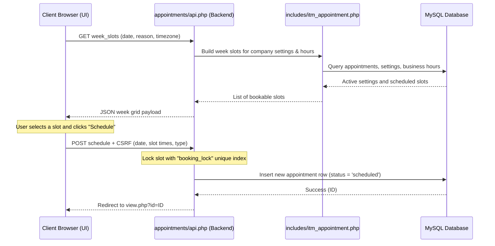

# Appointment Scheduling Subsystem

Comprehensive documentation for the employee self-service IT appointments scheduling system, weekly slot grid generation, multi-concurrency lock mechanisms, API actions, and administrative configuration.

---

## 1. Intent & Purpose

The **Appointment** subsystem (`modules/appointments/`) enables employees to schedule visits with the IT support desk. It streamlines support workflow by offering:
- Self-service booking for in-person or remote troubleshooting.
- Configurable appointment visit reasons.
- Real-time weekly slot selection based on tenant business hours and duration rules.
- Multi-concurrency booking locks to prevent double-booking.

---

## 2. System Architecture & Flow

The appointment system functions as a modular, tenant-scoped booking interface with real-time slot generation:



---

## 3. Database Schema & Tables

The subsystem coordinates several tables to manage business hours, timezone configurations, booking options, and appointments:

| Table | Primary Role | Multi-Tenancy Scoping |
|---|---|---|
| **`appointments`** | Holds booked slots, visit details, assignment status, and the `booking_lock` unique identifier. | `company_id` |
| **`appointment_type`** | Tenant lookup defining core support modalities (such as `in_person` or `remote`). | `company_id` |
| **`appointment_visit_reasons`** | Dropdown choices displayed to the user when booking (must be active and not soft-deleted). | `company_id` |
| **`appointment_settings`** | Global tenant settings specifying timezone, slot duration, bookable window, and check-in buffers. | `company_id` |
| **`appointment_business_hours`** | Configures daily hours, weekend closures, and modality restrictions (e.g. Wednesday remote-only). | `company_id` |

### Key Column Constraints & Schema Highlights

- **`appointments.booking_lock`:** A unique index across `(company_id, booking_lock)` that guarantees no two concurrent bookings can occupy the exact same slot on the same day for a company. On cancel/soft-delete, this string is cleared to release the slot.
- **`appointment_settings.default_appointment_modality`:** Specifies which `appointment_type` to pre-select when rendering multiple booking options.
- **`appointment_business_hours.allowed_types_json`:** JSON field defining specific active types permitted for each day of the week.

---

## 4. Business Rules & Booking Constraints

### A. Real-Time Slot Generation
The slot builder (`itm_appointment_build_week_slots()`) dynamically divides each day's open hours into increments based on `slot_duration_minutes`.
- **Weekend Closures:** Days marked `is_closed = 1` are excluded from slot generation.
- **Modality Restricting:** Weekdays can be restricted (e.g. Wednesday remote-only). The booking engine checks `allows_in_person` and `allows_remote` flags along with `allowed_types_json`.

### B. Validation Constraints
When a user attempts to schedule an appointment, the backend API enforces strict gates:
- **Mandatory Fields:** A visit reason must be chosen, and a slot must be active/selected. If submitted incomplete, client-side alerts prompt the user to make a valid selection.
- **Active Lookup Enforcement:** The visit reason ID must correspond to an active, non-deleted row in `appointment_visit_reasons`.
- **Concurrency Check:** If two sessions submit the same slot simultaneously, the transaction with the first insert commits the `booking_lock`, causing the second transaction to fail gracefully with a unique constraint violation instead of double-booking.

### C. Status, self-service, and email
- New bookings use `status = 'scheduled'`.
- **Cancel (owner/admin):** `api.php` `action=cancel` sets `cancelled`, clears `booking_lock`, notifies assignee when set.
- **Reschedule (owner/admin):** `reschedule_prepare` clears lock; `reschedule` updates slot in a transaction; sends confirmation email + `.ics`.
- **Confirmation email:** `itm_appointment_send_confirmation_email()` after schedule/reschedule (employee To, assignee CC when applicable).
- Soft-delete on delete POST still clears lock and sets `cancelled`.

---

## 5. UI Layout & User Experience

1. **Booking (`index.php`):** reason dropdown, weekly slot modal, type cards, **👤** My appointments link, inactive-settings banner.
2. **View (`view.php`):** owner/admin **📅** Reschedule and **🗑️** Cancel on scheduled rows.
3. **List (`list_all.php`):** `filter=mine`, date range, search, sort, pagination; inline assignee/confirmed for editors.

---

## 6. API Actions

`modules/appointments/api.php` — session + rate limit required.

| Action | Method | Notes |
|--------|--------|-------|
| `week_slots` | GET | `date`, optional `exclude_appointment_id`; `booking_disabled` when settings inactive |
| `schedule` | POST + CSRF | Past-slot rejected; confirmation email + ICS |
| `cancel` | POST + CSRF | Owner/admin; notifies assignee |
| `reschedule_prepare` | POST + CSRF | Clears `booking_lock` |
| `reschedule` | POST + CSRF | Transactional slot swap; email + ICS |

---

## 7. Related Files

| Path | Primary Role |
|---|---|
| `modules/appointments/index.php` | Main entry point for booking UI, list review, and delete forms. |
| `modules/appointments/api.php` | API endpoint for week-grid slots and schedule submission. |
| `modules/appointments/list_all.php` | Administrative wrapper routing to the all-bookings list view. |
| `modules/appointments/view.php` | Detail view showing assignment and confirmation flags. |
| `includes/itm_appointment.php` | Core backend functions, slot duration builders, and weekday modality maps. |
| `js/appointment.js` | UI logic managing slot selection modals, weekly navigation, and AJAX API posts. |
| `css/appointment.css` | Styles for the week-grid modal and modality radio cards. |

---

## 8. Troubleshooting & Verification

### Common Pitfalls
- **Empty Reasons Dropdown:** If all visit reasons are deleted or disabled, the booking dropdown will appear empty. Ensure active reasons are seeded under `appointment_visit_reasons`.
- **Modality Exclusions:** Wed-only remote rules or custom day exclusions are driven by `appointment_business_hours` configurations. Double-check weekday modality flags if slots fail to render.
- **Unique Booking Failures:** If a slot is cancelled but `booking_lock` is not cleared (NULL), that slot remains blocked permanently. Ensure soft-delete handlers correctly NULL the lock string.

### Automated Verification
To run the automated test suite and verify appointment routing, database triggers, and concurrency gates, execute from the repository root:

```bash
php scripts/verify_appointment.php
```
