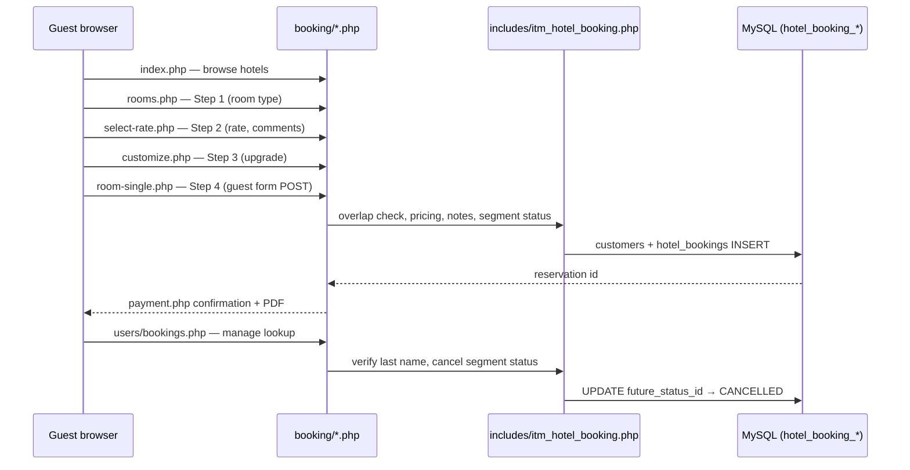

# Hotel Booking Public Portal

Comprehensive review and reference for the guest-facing hotel booking portal under `booking/`, its four-step checkout, manage-reservation flow, ITM admin modules, and shared helpers.

**Agent notes (folder):** `booking/AGENT_NOTES.md` — entry points and file layout.  
**Helpers:** `includes/itm_hotel_booking.php` (loaded from `config/config.php`).

---

## 1. Intent & purpose

The **public booking portal** (`booking/`) lets guests browse hotels, select dates and rooms, complete a four-step checkout without ITM employee login, and manage an existing reservation with **last name + guest confirmation code** (`hotel_bookings.guest_confirmation_code` — opaque 10-character code, not sequential `hotel_bookings.id`) **+ auth2 code** (`hotel_bookings.auth2` — 12-character complex code on new bookings; legacy 4-digit PINs are retired via `itm_hotel_booking_portal_backfill_legacy_auth2_groups()`) plus a **6-digit email OTP** before the manage view loads.

Staff configure inventory, rates, and policies in ITM **Hospitality** modules (`modules/hotel_bookings/`, `modules/hotel_booking_hotels/`, etc.). The portal reads that data through MySQLi helpers scoped by `company_id`.

**Design constraints:**

- Procedural PHP; no separate framework under `booking/`.
- `bootstrap.php` sets `ITM_HOTEL_BOOKING_PUBLIC_PORTAL` so `config/config.php` skips employee login for this tree.
- Single stylesheet: `booking/css/hotel-booking-modern.css`.
- No online payment gateway — confirmation states **Payment at the hotel**.

---

## 2. Architecture overview



### Bootstrap & tenant

| Piece | Role |
|-------|------|
| `booking/bootstrap.php` | Session, `ITM_HOTEL_BOOKING_PUBLIC_PORTAL`, `APPURL`, `hb_public_company_id()`, `hb_load_active_hotel_row()` |
| `hb_public_company_id()` | Welcome copy / default portal tenant (session `company_id` or first `public_portal_enabled` row in `hotel_booking_settings`, fallback company 1) |
| `hb_company_public_portal_enabled()` / `hb_require_company_public_portal()` | Hard gate: browse/book and calendar JSON require the hotel’s company `public_portal_enabled`; home list skips disabled tenants |
| `itm_hotel_booking_portal_insert_booking_locked()` | Step 4 create: room row `FOR UPDATE` + overlap re-check + INSERT in one transaction; multi-room uses nested locks inside `insert_stay_bookings_locked()` outer transaction |
| `itm_hotel_booking_portal_manage_rate_limit_check()` / `_record()` | Session throttle for manage lookup/cancel POSTs |
| `itm_hotel_booking_portal_manage_otp_rate_limit_check()` / `_record()` | Separate session + IP throttle for email OTP verify (default 5 / 10 min) |
| `hb_load_active_hotel_row()` | Active hotel by `id` across all companies (used by `rooms.php`, `calendar.php`) |
| `config/config.php` | Shared DB connection, CSRF, date helpers |

### Shared portal includes

| File | Role |
|------|------|
| `includes/portal_chrome.php` | Header, stay bar, money format, amenity icons, guest rating block |
| `includes/portal_checkout.php` | Stepper, reservation summary, payment confirmation, manage-booking aside actions |
| `includes/portal_room_detail.php` | Room-type detail modal markup (Steps 1 & 3) |

### Front-end assets

| Asset | Used on |
|-------|---------|
| `hotel-booking-public.js` | `index.php` — hotel detail modal, gallery |
| `hotel-booking-dates.js` | `index.php` — Select Dates modal (check-in + check-out range; **◀ / ▶** month nav; auto-advance when `daysLeftInMonth < calendar_month_advance_days_left` from hotel settings) |
| `hotel-booking-amenity-icons.js` | Amenity SVG resolution |
| `hotel-booking-select-room.js` | `rooms.php` — filters, occupancy/rates modals (Step 1 reload), room detail |
| `hotel-booking-occupancy.js` | Checkout steps 2–4 — stay-bar occupancy modal AJAX via `apply-occupancy.php` |
| `hotel-booking-customize.js` | `rooms/customize.php` — upgrade totals, room detail modal |
| `hotel-booking-confirmation-pdf.js` | Confirmation PDF (self-hosted html2canvas + jsPDF from `js/vendor/`); adds a `/URI` link annotation over **Manage my booking** |
| `hotel-booking-change-booking.js` | Manage booking — hotel contacts modal |

Hotel photos are managed in **Hotels** (`modules/hotel_booking_hotels/`). **Room gallery images are managed per room type** in **Room Types** (`modules/booking_rooms_types/`). Files live under `booking/images/{hotel_id}/hotel_photos/` and `booking/images/{hotel_id}/room_types_photos/`; the portal serves them as `APPURL/images/{hotel_id}/…`. Committed portal fallbacks (`image_2.jpg`, `room-3.jpg`, `room-5.jpg`, `room-6.jpg`, plus seed helpers `image_3.jpg` / `services-2.jpg`) live under `booking/images/` when uploads are missing. Static amenity SVGs remain under `booking/images/amenities/` only.

---

## 3. Guest flows

### A. New booking (4 steps)

| Step | URL | Summary |
|------|-----|---------|
| 0 | [index.php](http://localhost/it-management/booking/index.php) | Hotel list (all active hotels, all companies); detail modal; **Select Dates** (1 night = single check-in; range = multi-night) |
| 1 | [rooms.php](http://localhost/it-management/booking/rooms.php) | Room types, special rates, filters, occupancy (stay-bar modal reloads query) |
| 2 | [rooms/select-rate.php](http://localhost/it-management/booking/rooms/select-rate.php) | Room-only vs breakfast; stay-bar occupancy modal (AJAX) |
| 3 | [rooms/customize.php](http://localhost/it-management/booking/rooms/customize.php) | Optional room upgrade; pets/special requests; stay-bar occupancy modal (AJAX) |
| 4 | [rooms/room-single.php](http://localhost/it-management/booking/rooms/room-single.php) | Guest name, email, phone (E.164); stay-bar occupancy modal (AJAX); creates booking |
| — | [rooms/payment.php](http://localhost/it-management/booking/rooms/payment.php) | Confirmation, PDF download, manage link |

Draft state (dates, rate, occupancy, upgrade) is stored in session via `itm_hotel_booking_portal_draft_*` helpers until step 4 succeeds. Changing occupancy on steps 2–4 POSTs to [`apply-occupancy.php`](http://localhost/it-management/booking/apply-occupancy.php) (`itm_hotel_booking_portal_apply_checkout_occupancy_change()`): same guest counts re-validate the draft and reload; room-count changes or invalid picks clear the draft and return to Step 1; failures show `hb-occupancy-unavailable-modal`.

**Step 4 charge:** `itm_hotel_booking_portal_resolve_step4_charge()` re-reads BAR (`itm_hotel_booking_resolve_room_type_nightly_bar`), special-rate discount, and plan discount/surcharge from the database at INSERT time — session draft money fields are not trusted. Multi-room stays re-resolve **each** `room_lines` row via `itm_hotel_booking_portal_resolve_room_lines_pricing_from_db()`.

**Step 4 confirmation emails:** Admin → [Hotel Booking Settings](http://localhost/it-management/modules/hotel_booking_settings/index.php) toggles `portal_confirmation_email_guest` and `portal_confirmation_email_reservations` (default both on). `itm_hotel_booking_portal_send_booking_confirmation_emails()` sends after direct Step 4 save and after Stripe webhook payment; guest uses `customer_email`, reservations desk uses the hotel’s `reservations_email`.

**Portal display (admin):** Same settings screen — **Portal display** card: `portal_show_room_number_on_confirmation` (default off) prefixes assigned room numbers on guest summaries and confirmation; `portal_hide_upgrade_upsell_when_multi_room` (default on) hides Step 3 upgrade upsell when `occupancy.rooms > 1`; `portal_money_symbol` (`EUR`/`GBP`/`USD`) with suffix (default on, e.g. `69.50€`) or prefix style for all portal price rendering (`hb_portal_bind_money_settings()`, `hotel-booking-money.js`, `itm_hotel_booking_portal_public_settings_for_js()`).

**Guest-facing copy (admin):** [Hotel Booking Settings](http://localhost/it-management/modules/hotel_booking_settings/index.php) → **Marketing copy** — `welcome_title` (home H1), `portal_direct_book_banner_text` (Step 1 banner), `portal_rating_title` / `portal_rating_subtitle` (header bubble), `portal_step_label_room|rate|customize|payment` (checkout H1 + sidebar stepper), `portal_step_progress_template` (default `Step {step} of {total}` on Steps 1–4), `portal_manage_booking_label` (nav, manage page, confirmation CTA/hint), `portal_accessible_room_banner_text` (Step 1 when `portal_accessible_banner_enabled`), `portal_disabled_message` (JSON 403 when `public_portal_enabled` is off). Helpers: `itm_hotel_booking_portal_checkout_step_heading_from_settings()`, `itm_hotel_booking_portal_manage_booking_label_from_settings()`, etc. in `includes/itm_hotel_booking.php`.

**Portal UI copy (`portal_ui_*`):** 267 individual `TEXT` columns split across four satellite tables (`hotel_booking_portal_ui_copy_home`, `_step1`, `_checkout`, `_confirm`) because InnoDB row-size limits block storing them all on `hotel_booking_settings`. Registry: `includes/itm_hotel_booking_portal_ui_copy_registry_data.php`; getter `itm_hotel_booking_portal_ui_copy_from_settings()`; `itm_hotel_booking_settings_row()` merges satellite rows; admin saves via `itm_hotel_booking_portal_ui_copy_save_values()`. Migration: `db/migrations/hotel_booking_portal_ui_copy.sql`.

**Internal rate codes:** Admin create/edit on `modules/hotel_bookings/` — `internal_rate_code` enum (`use`, `comp`, or empty). **USE** waives room charges only (tourist tax still applies); **COMP** waives all charges. Optional guest exposure via `portal_show_internal_rates` on Special rates (Step 1). Checkout applies `itm_hotel_booking_apply_internal_rate_to_breakdown()`; persisted on `hotel_bookings.internal_rate_code` at INSERT.

**Portal date/time formats (admin):** `portal_date_format` (European DD/MM/YYYY default, European DD/MMM/YYYY, US, ISO), `portal_time_format` (24h default / 12h), datetime display enable flags + `portal_datetime_format_default` (European `17/AUG/YYYY HH:mm` default). Portal PHP uses `hb_portal_format_date_display()` / `hb_portal_format_datetime_display()`; JS uses `hotel-booking-date-format.js` + `HB_SETTINGS` keys. Regression: `php scripts/verify_hotel_booking_portal_date_formats.php`.

**Pricing:** nightly room charges use the base price per night defined per room type and hotel in `hotel_booking_room_type_base_prices.price_per_night` plus per-hotel portal rules on `hotel_booking_hotels` (breakfast adult/child add-on, child nightly supplement, extra-adult %, pet daily fee — edited in **Portal Rate Plans** admin, not hardcoded in `booking/`). Special-rate discount % comes from `hotel_booking_special_rates`. Step 2 plans add `plan_discount_percent` then optional `plan_surcharge_percent` (0–50 each; surcharge raises after discount). Tourist tax is company-level (`hotel_booking_settings.tourist_tax_per_person_per_night`, default €2/guest/night in seeds). Breakdown: `itm_hotel_booking_portal_checkout_breakdown()` → `itm_hotel_booking_portal_hotel_pricing()`.

**Availability:** `itm_hotel_booking_has_overlap()` blocks double-booking; cancelled bookings are excluded from overlap.

### B. Manage existing reservation

[users/bookings.php](http://localhost/it-management/booking/users/bookings.php) — guest enters **last name** + **confirmation number** (`guest_confirmation_code`, 10 characters) + **auth code** (`auth2`, 12-character complex code). After PIN verification the portal emails a **6-digit OTP** (10-minute expiry) before showing the confirmation or allowing cancel (no account required).

After lookup:

- Main column: same confirmation card as `payment.php` (room **type** title without room number).
- **Cancelled** stays: red header (`Reservation cancelled`), status badge, no PDF save.
- Stay bar: hotel, dates, occupancy (**read-only** on manage booking; **interactive modal** on checkout steps 1–4); **Edit stay** / **Logout** links back to date picker on home.
- Aside actions:
  - **Cancellation policy** — opens per-rate HTML under `booking/cancellation_policy/` (configurable in Portal Rate Plans). Relative URLs are restricted to `.html` / `.htm` / `.txt`; folder `.htaccess` blocks PHP execution.
  - **Change booking** — modal with hotel name, directions (Google Maps), website, phone.
  - **Cancel Booking** — future segment only; sets segment status to `CANCELLED` (CSRF + re-verify last name).

### C. Optional portal accounts

`auth/login.php`, `register.php`, `logout.php` — `hotel_booking_portal_users` linked to `customers`. **Not required** for browse/book/manage-by-confirmation-number.

### D. Calendar API

`calendar.php` — JSON nightly rates for the date modal (`itm_hotel_booking_hotel_calendar_month()`). Day `price` values are **tax-inclusive** for the requested occupancy (`prices_include_tax`; `bar_excl_tax` keeps the room-only BAR).

---

## 4. Database model (portal-relevant)

| Table | Portal use |
|-------|------------|
| `hotel_booking_settings` | `public_portal_enabled`, welcome copy, tourist tax, free-cancellation days before check-in (default 5), Select Dates calendar advance threshold `calendar_month_advance_days_left` (default 3), `show_discount_strikethrough` (default 1 — list-price strikethrough on Step 1/2), reviews URL, **`portal_complimentary_min_rooms_paid`** / **`portal_complimentary_rooms_free`** (multi-room complimentary credit; `0` min = disabled) |
| `hotel_booking_hotels` | Property name, location, phone, website, currency, check-in/out times, **portal step pricing** (`portal_breakfast_*`, `portal_child_nightly_supplement`, `portal_extra_adult_supplement_percent`, `portal_pet_daily_fee`) |
| `hotel_booking_room_type_base_prices` | Base price per night per room type and hotel |
| `hotel_booking_rooms` | Inventory, link to room type |
| `booking_rooms_types` | Type name, bed summary, upgrade pricing, **portal rule columns** (occupancy caps, stay/CTA/CTD, pricing overrides with `NULL` = inherit hotel, `portal_bookable`, `requires_approval`, pets, connecting room type, mixed-type groups) |
| `hotel_bookings` | Reservations; segment status FKs; **`guest_confirmation_code`** (opaque 10-char guest-facing confirmation); **`auth2`** (12-char complex guest manage code); `notes` (rate plan, occupancy meta, comments) |
| `hotel_booking_last_rooms` | Last assigned room snapshot per reservation (`booking_id`); planning empty row for CANCELLED / NO-SHOW |
| `hotel_bookings_future` / `present` / `history` | Status lookups (`PENDING`, `CANCELLED`, etc.) — no ENUM |
| `customers` | Guest PII; ensured on book via `itm_hotel_booking_ensure_customer_for_portal()` (repeat book by email refreshes `name` / `phone`) |
| `hotel_booking_portal_rate_plans` | Per-hotel cancellation policy URLs (slots 1–4) |
| `hotel_booking_special_rates` | Member, AAA, promo, etc. — discount % per hotel |
| `hotel_booking_special_rate_codes` | Registered promo/group/corporate/member codes per hotel (portal validates against this table) |
| `hotel_booking_amenities` | Icons (`icon_slug` → `booking/images/amenities/*.svg`) |

**Segment resolution:** `itm_hotel_booking_resolve_segment(check_in, check_out)` picks which status column applies (`future_status_id`, `present_status_id`, `history_status_id`). Online cancel only when segment is `future` and status is not already `CANCELLED`.

**Notes contract:** `itm_hotel_booking_portal_build_booking_notes()` stores rate plan, guest comments, upgrade lines, and a machine-readable occupancy line (`Occupancy: rooms=…`) parsed on confirmation display.

### Room type portal rules (guest enforcement)

Rules live on `booking_rooms_types` (fresh installs: `db/01_schema.sql` only — no migration file). Helpers in `includes/itm_hotel_booking.php`:

| Area | Behaviour |
|------|-----------|
| Step 1 (`rooms.php`) | `portal_bookable`, `itm_hotel_booking_portal_room_type_validate_stay()`, per-slot `cardQuoteOccupancy` for fits + quote (`min_adults`, `max_total_guests` + `max_extra_beds`, `child_max_age` bands, connecting-unit combined capacity + inventory), mixed-type lock when `allow_mixed_types_in_group = 0`, `max_rooms_per_booking`, connecting-room **unit** banner |
| Step 2 (`select-rate.php`) | Re-validates bookable + stay; connecting units pick + rate **both** `room_lines` before Step 3 (`crib_included` zeros baby supplement in quotes) |
| Step 3 (`customize.php`) | Pets block only when **all** rated lines allow pets (`itm_hotel_booking_portal_draft_pet_policy()`); otherwise “No special requests available.” |
| Checkout | `requires_approval` → “Subject to hotel approval”; complimentary credit from settings when room count exceeds threshold |
| Pricing overrides | `portal_*` columns on the type row; `NULL` inherits `hotel_booking_hotels` portal pricing |
| Multi-room guests | `itm_hotel_booking_portal_split_occupancy_for_room_line()` splits adults/children/babies across rooms for quotes and banners |

Regression: `php scripts/run_tests.php --filter HotelBookingRoomTypePortalRules` and `php scripts/verify_hotel_booking.php`.

---

## 5. ITM admin modules (Hospitality sidebar)

| Module | Purpose |
|--------|---------|
| `modules/hotel_bookings/` | Planning grid, Future/Present/History boards, booking CRUD |
| `modules/hotel_booking_hotels/` | Properties, photos, nearby places |
| `modules/hotel_booking_rooms/` | Physical rooms |
| `modules/booking_rooms_types/` | Room types, upgrade targets |
| `modules/hotel_booking_settings/` | Portal on/off, welcome text, tourist tax, free-cancellation days, Select Dates calendar advance days-left threshold |
| `modules/hotel_booking_portal_rate_plans/` | Cancellation policy URLs per rate slot; **portal step pricing** form per hotel |
| `modules/hotel_booking_special_rates/` | Discount programs per hotel; register portal codes (promo, group, corporate, member) |
| `modules/hotel_booking_amenities/` | Amenity catalog + icon slugs |
| `modules/hotel_booking_room_utilities/` | Room ↔ amenity links |
| `modules/hotel_booking_housekeeping_statuses/` | HK status lookup |
| `modules/hotel_bookings_future` / `present` / `history` | Lifecycle status names |

Fresh schema: `db/01_schema.sql`, seeds `db/02_data.sql`, triggers `db/03_triggers.sql`. Existing DBs: `db/migrations/hotel_booking*.sql` (apply in filename order).

---

## 6. Local development URLs

Open in a **new browser tab** (no employee login required for portal pages):

| Page | URL |
|------|-----|
| Booking home | [http://localhost/it-management/booking/](http://localhost/it-management/booking/) |
| Manage my booking | [http://localhost/it-management/booking/users/bookings.php](http://localhost/it-management/booking/users/bookings.php) |
| Hotel bookings (admin) | [http://localhost/it-management/modules/hotel_bookings/index.php](http://localhost/it-management/modules/hotel_bookings/index.php) |
| Portal rate plans (admin) | [http://localhost/it-management/modules/hotel_booking_portal_rate_plans/](http://localhost/it-management/modules/hotel_booking_portal_rate_plans/) |
| Verify script (CLI) | `php scripts/verify_hotel_booking.php` |

Seed example: company 1 **TechCorp Retreat**, reservation IDs from `hotel_bookings` after a test book.

---

## 7. Review (current state)

### Strengths

- **Clear four-step UX** aligned with major hotel sites; shared stepper and reservation summary reduce duplication.
- **ITM integration** — one database, tenant scoping, audit triggers on admin tables, photo uploads via shared helpers.
- **Manage booking** — lookup without passwords; cancellation policy, change (contact hotel), and online cancel while check-out is still in the future (future and present segments).
- **Legacy cleanup** — removed Colorlib template, PDO admin-panel, and vendored jQuery/Bootstrap; ~37 active portal files remain.
- **Regression script** — `scripts/verify_hotel_booking.php` covers segments, guest match, pricing, cancel helpers, PDF JS.
- **Unicode & dates** — UTF-8 end-to-end; stay dates use hospitality **`d/M/Y`** (`31/Aug/2026`, `01/Oct/2026`) via `itm_format_hotel_date_display()` / `itm_render_hotel_date_input()`; MySQL storage stays `Y-m-d`.

### Gaps & risks

| Area | Notes |
|------|--------|
| **No online payment** | By design; confirmation copy must stay accurate if payment is added later. |
| **Manage auth** | Last name + **guest confirmation code** + **auth2** (12-character complex code) + **email OTP** before manage/cancel. Session **and client IP** rate limits (lookup/cancel 12 / 15 min; OTP verify 5 / 10 min). |
| **`hotel_booking_portal_rate_plans`** | Required for cancellation policy links; verify script fails if migration not applied on live DB (`db/migrations/hotel_booking_portal_rate_plans.sql`). |
| **Portal pricing columns** | `hotel_booking_hotels` portal pricing fields — apply `db/migrations/hotel_booking_portal_hotel_pricing.sql` on existing DBs (destructive; back up hotel rows first). |
| **Portal user accounts** | Optional `auth/*` rarely used; logout currently redirects to login, not home (pending UX tweak). |
| **Stay bar on manage** | Shows **Edit stay** (same as checkout) rather than exit/logout — may confuse guests who only wanted to leave manage view. |
| **Single company in session** | Welcome banner still uses `hb_public_company_id()`; hotel grid lists only portal-enabled companies. Booking steps resolve tenant from the selected hotel row and enforce `public_portal_enabled`. |

### Recommended follow-ups (not implemented here)

1. Apply `hotel_booking_portal_rate_plans` migration on all environments; keep `01_schema.sql` in sync.
2. On manage booking: **Logout** → `auth/logout.php` → `index.php` (stay-bar occupancy stays read-only on manage/payment confirmation).
3. MBQA browser step for full portal flow (index → payment → manage cancel).
4. Apply `db/migrations/hotel_bookings_auth2_strong.sql` on existing databases (destructive to `hotel_bookings` rows — back up first).

---

## 8. Troubleshooting

| Symptom | Likely cause |
|---------|----------------|
| Empty hotel list | No rows with `hotel_booking_hotels.active = 1` and `deleted_at IS NULL` (any company) |
| Cancellation policy link missing | No `hotel_booking_portal_rate_plans` row or empty `cancellation_policy_url` |
| `verify_hotel_booking.php` fails on rate plans table | Run `db/migrations/hotel_booking_portal_rate_plans.sql` on existing DB |
| Room not available on book | Overlap with non-cancelled booking on same `room_id` |
| Manage lookup fails | Last name must match `customers.name` (case-insensitive token match); confirmation number = `hotel_bookings.guest_confirmation_code`; auth code = `hotel_bookings.auth2` (12-char complex code); complete email OTP step |
| Cancel button hidden | Stay not in `future` segment or already `CANCELLED` |
| PDF download fails | Confirm `booking/js/vendor/html2canvas-1.4.1.min.js` and `jspdf-2.5.1.umd.min.js` load (200); check browser console |
| PDF “Manage my booking” not clickable | Regenerate after update — confirmation PDF must include a jsPDF `link()` annotation over `data-hb-pdf-manage-link` (html2canvas alone paints pixels only) |

### Verification commands

```bash
php scripts/verify_hotel_booking.php
php -l booking/bootstrap.php
php -l booking/includes/portal_checkout.php
php -l booking/users/bookings.php
```

See also `scripts/SCRIPTS.md` — hotel booking section.

---

## 9. Related files (quick index)

```
booking/
├── bootstrap.php
├── index.php, rooms.php, calendar.php
├── rooms/          # Steps 1–4, payment, confirmation-pdf
├── users/bookings.php
├── cancellation_policy/*.html (+ .htaccess blocks PHP)
├── auth/           # Optional portal login
├── includes/       # portal_chrome, portal_checkout, portal_room_detail
├── css/hotel-booking-modern.css
├── js/hotel-booking-*.js
├── images/
│   ├── amenities/*.svg
│   ├── image_2.jpg, image_3.jpg, services-2.jpg  # gallery / seed fallbacks
│   ├── room-3.jpg, room-5.jpg, room-6.jpg        # room-type code fallbacks
│   └── {hotel_id}/
│       ├── hotel_photos/       # Hotels admin uploads
│       └── room_types_photos/  # Room Types admin uploads (portal room cards)

includes/itm_hotel_booking.php
modules/hotel_bookings/
scripts/verify_hotel_booking.php
```
