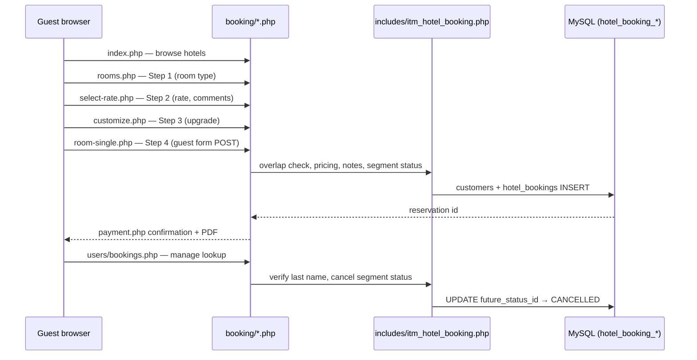

# Hotel Booking & Hospitality Management System

Comprehensive review and reference for the guest-facing hotel booking portal under `booking/`, its four-step checkout, manage-reservation flow, the ITM Hospitality admin modules, and developer integration protocols.

**Agent notes (folder):** `booking/AGENT_NOTES.md` — entry points and file layout.  
**Helpers:** `includes/itm_hotel_booking.php` (loaded from `config/config.php`).

---

## 1. Intent & purpose

The **ITM Hospitality & Booking System** comprises a dual-sided architecture:
1. A public, guest-facing **booking portal** (`booking/`) allowing guests to browse hotels, select dates/rooms, and complete checkouts.
2. A private, staff-facing **Hospitality administration suite** under `modules/` allowing employees to configure inventory, rates, properties, and track check-ins, check-outs, and housekeeping statuses.

### Guest Portal Design Constraints:
- Procedural PHP; no separate framework under `booking/`.
- `bootstrap.php` sets `ITM_HOTEL_BOOKING_PUBLIC_PORTAL` so `config/config.php` skips employee login for this tree.
- Single stylesheet: `booking/css/hotel-booking-modern.css`.
- No online payment gateway — confirmation states **Payment at the hotel**.

### Administrative Backend Design Constraints:
- Strict multi-tenant isolation scoped by `company_id`.
- Inter-module data integrity and transactional consistency for booking modifications, room allocations, and housekeeping logs.
- Dynamic responsive UI overlays with modular controls, planning colors, and custom grids.

---

## 2. Architecture overview



### Bootstrap & tenant

| Piece | Role |
|-------|------|
| `booking/bootstrap.php` | Session, `ITM_HOTEL_BOOKING_PUBLIC_PORTAL`, `APPURL`, `hb_public_company_id()`, `hb_load_active_hotel_row()` |
| `hb_public_company_id()` | Welcome copy / default portal tenant (session `company_id` or first `public_portal_enabled` among companies 1–5) |
| `hb_load_active_hotel_row()` | Active hotel by `id` across all companies (used by `rooms.php`, `calendar.php`) |
| `config/config.php` | Shared DB connection, CSRF, date helpers |

### Shared portal includes

| File | Role |
|------|------|
| `includes/portal_chrome.php` | Header, stay bar, money format, amenity icons, guest rating block |
| `includes/portal_checkout.php` | Stepper, reservation summary, payment confirmation, manage-booking aside actions |
| `includes/portal_room_detail.php` | Room-type detail modal markup (Steps 1 & 3) |

### Front-end assets

| Asset | Used on |
|-------|---------|
| `hotel-booking-public.js` | `index.php` — hotel detail modal, gallery |
| `hotel-booking-dates.js` | `index.php` — Select Dates modal (check-in + check-out range; **◀ / ▶** month nav; auto-advance to next month when check-in is in the last week) |
| `hotel-booking-amenity-icons.js` | Amenity SVG resolution |
| `hotel-booking-select-room.js` | `rooms.php` — filters, occupancy/rates modals, room detail |
| `hotel-booking-customize.js` | `rooms/customize.php` — upgrade totals, room detail modal |
| `hotel-booking-confirmation-pdf.js` | Confirmation PDF (html2canvas + jsPDF) |
| `hotel-booking-change-booking.js` | Manage booking — hotel contacts modal |

Hotel and room photos are served from `images/hotel_booking/{company_id}/…` via ITM upload helpers, not from static files under `booking/images/` (amenity SVGs only).

---

## 3. Guest flows

### A. New booking (4 steps)

| Step | URL | Summary |
|------|-----|---------|
| 0 | [index.php](http://localhost/it-management/booking/index.php) | Hotel list (all active hotels, all companies); detail modal; **Select Dates** (1 night = single check-in; range = multi-night) |
| 1 | [rooms.php](http://localhost/it-management/booking/rooms.php) | Room types, special rates, filters, occupancy |
| 2 | [rooms/select-rate.php](http://localhost/it-management/booking/rooms/select-rate.php) | Room-only vs breakfast, pets, special requests |
| 3 | [rooms/customize.php](http://localhost/it-management/booking/rooms/customize.php) | Optional room upgrade; reservation summary sidebar |
| 4 | [rooms/room-single.php](http://localhost/it-management/booking/rooms/room-single.php) | Guest name, email, phone (E.164); creates booking |
| — | [rooms/payment.php](http://localhost/it-management/booking/rooms/payment.php) | Confirmation, PDF download, manage link |

Draft state (dates, rate, occupancy, upgrade) is stored in session via `itm_hotel_booking_portal_draft_*` helpers until step 4 succeeds.

**Pricing:** nightly room charges, special-rate discount, breakfast supplement, pet fee, tourist tax (`hotel_booking_settings.tourist_tax_per_person_per_night`, default €2/guest/night in seeds). Breakdown helpers live in `itm_hotel_booking_portal_checkout_breakdown()`.

**Availability:** `itm_hotel_booking_has_overlap()` blocks double-booking; cancelled bookings are excluded from overlap.

### B. Manage existing reservation

[users/bookings.php](http://localhost/it-management/booking/users/bookings.php) — guest enters **last name** + **reservation ID** (no account required).

After lookup:
- Main column: same confirmation card as `payment.php` (room **type** title without room number).
- **Cancelled** stays: red header (`Reservation cancelled`), status badge, no PDF save.
- Stay bar: hotel, dates, occupancy; **Edit stay** links back to date picker on home (checkout flow uses the same control).
- Aside actions:
  - **Cancellation policy** — opens per-rate HTML under `booking/cancellation_policy/` (configurable in Portal Rate Plans).
  - **Change booking** — modal with hotel name, directions (Google Maps), website, phone.
  - **Cancel Booking** — future segment only; sets segment status to `CANCELLED` (CSRF + re-verify last name).

### C. Optional portal accounts

`auth/login.php`, `register.php`, `logout.php` — `hotel_booking_portal_users` linked to `customers`. **Not required** for browse/book/manage-by-confirmation-number.

### D. Calendar API

`calendar.php` — JSON nightly rates for the date modal (`itm_hotel_booking_hotel_calendar_month()`).

---

## 4. Database model

| Table | Scoping / Use |
|-------|------------|
| `hotel_booking_settings` | `public_portal_enabled`, welcome copy, tourist tax, reviews URL |
| `hotel_booking_hotels` | Property name, location, phone, website, currency, check-in/out times |
| `hotel_booking_rooms` | Inventory, `price_per_night`, link to room type, hotel references |
| `booking_rooms_types` | Type name, bed summary, upgrade pricing and target room definitions |
| `hotel_bookings` | Reservations; segment status FKs; payment details; planning color; `notes` (metadata) |
| `hotel_bookings_future` | Status lookups for future stays (`PENDING`, `CANCELLED`, etc.) — no ENUM |
| `hotel_bookings_present` | Status lookups for active stays (`CHECKED_IN`, `IN_HOUSE`, etc.) — no ENUM |
| `hotel_bookings_history` | Status lookups for completed/past stays (`CHECKED_OUT`, `NO_SHOW`, etc.) — no ENUM |
| `customers` | Guest PII; ensured on book via `itm_hotel_booking_ensure_customer_for_portal()` |
| `hotel_booking_portal_rate_plans` | Cancellation policy URLs (slots 1–4) and parent rate definitions |
| `hotel_booking_special_rates` | Member, AAA, promo, etc. — discount % per hotel |
| `hotel_booking_amenities` | Icons (`icon_slug` → `booking/images/amenities/*.svg`) |
| `hotel_booking_room_utilities` | Junction table associating physical rooms with active amenities |
| `hotel_booking_housekeeping_statuses` | Room cleaning state codes (`CLEAN`, `DIRTY`, `TOUCH_UP`, etc.) |
| `hotel_booking_housekeeping_maintenance` | Action logs tracking out-of-order rooms and maintenance constraints |

**Segment resolution:** `itm_hotel_booking_resolve_segment(check_in, check_out)` picks which status column applies (`future_status_id`, `present_status_id`, `history_status_id`). Online cancel only when segment is `future` and status is not already `CANCELLED`.

**Notes contract:** `itm_hotel_booking_portal_build_booking_notes()` stores rate plan, guest comments, upgrade lines, and a machine-readable occupancy line (`Occupancy: rooms=…`) parsed on confirmation display.

---

## 5. ITM admin modules (Hospitality sidebar)

The backend administration of the Hospitality system features a comprehensive set of management tools accessible under the "Hospitality" section in the ITM sidebar:

| Module | Location | Purpose |
|--------|---------|---------|
| **Hotel Bookings** | `modules/hotel_bookings/` | Operational planning grid, Future/Present/History status boards, and booking CRUD |
| **Hotels** | `modules/hotel_booking_hotels/` | Configures property profiles, contact info, check-in rules, and photos |
| **Rooms** | `modules/hotel_booking_rooms/` | Physical inventory tracking mapped to hotels and room types |
| **Room Types** | `modules/booking_rooms_types/` | Bed specifications, standard pricing, and upgrade targets |
| **Amenities** | `modules/hotel_booking_amenities/` | Shared lookup catalog for hotel amenities and icon slugs |
| **Room Utilities** | `modules/hotel_booking_room_utilities/` | Maps specific amenities to physical rooms |
| **Housekeeping Statuses**| `modules/hotel_booking_housekeeping_statuses/` | Cleaning codes and visual badges |
| **Maintenance** | `modules/hotel_booking_housekeeping_maintenance/`| Housekeeping and out-of-order blocks |
| **Portal Rate Plans** | `modules/hotel_booking_portal_rate_plans/` | Configures cancellation rules and rates per hotel slot |
| **Special Rates** | `modules/hotel_booking_special_rates/` | Custom discount policies (AAA, points, promos) |
| **Settings** | `modules/hotel_booking_settings/` | Toggle portal on/off, tourist tax rate, and welcome banners |

---

## 6. Architecture of Administrative Backend Workflows

### A. Operational Planning Grid
The core dashboard of the Hospitality backend features an interactive chronological planning grid (`modules/hotel_bookings/js/hotel-bookings-planning.js`):
- **Draggable Bookings:** Bookings appear as horizontal blocks that can be resized or dragged across rooms and dates to adjust check-in/out schedules.
- **Housekeeping Blocks:** Rooms marked as out-of-order or dirty appear highlighted to prevent staff from placing guests in unready rooms.
- **Color Coding:** The background color of a booking block is dynamically driven by `hotel_bookings.booking_color`, allowing staff to categorize bookings visually.

### B. Segment Status Boards (Future / Present / History)
Rather than a unified status column, bookings are managed across three distinct logical lifecycles based on chronological segments (Future, Present, Past).
- Staff transition bookings between states (e.g. from `PENDING` to `CHECKED_IN`, then `CHECKED_OUT`).
- The system automatically triggers the appropriate status lookup joins based on the active date segment of the booking.

---

## 7. Developer Guide: Portal Rate Plan Quick-Add Mechanism

To improve backend efficiency, the booking create and edit forms (`modules/hotel_bookings/create.php` and `edit.php`) feature an integrated **Portal Rate Plan Quick-Add** mechanism. This allows staff to quickly create, view, or edit a rate plan inline without navigating away from the current form.

```
+--------------------------------------------------------+
| Customer: [ Select Customer                       ]   |
| Room:     [ Room 101 (Double)                     ]   |
|                                                        |
| Portal Rate Plan:                                      |
| [ Standard Rate (RO)                             ] ➕  |
|                                                        |
|   +------------------------------------------------+   |
|   |  #hb-rate-plan-modal                           |   |
|   |  +------------------------------------------+  |   |
|   |  | iframe: portal_rate_plans/create.php     |  |   |
|   |  |                                          |  |   |
|   |  | [ Save ]                                 |  |   |
|   |  +------------------------------------------+  |   |
|   +------------------------------------------------+   |
+--------------------------------------------------------+
```

### A. Dynamic Option Hook
The select field for the Portal Rate Plan (`#hb-booking-portal-rate-plan-id`) includes a quick-add trigger option:
```html
<option value="__add_new__">➕</option>
```
When this option is selected, the JavaScript handler in `js/hotel-bookings-rate-plan-select.js` intercepts the change event, prevents default submission, and launches the iframe-based modal.

### B. Iframe Modal Structure (`#hb-rate-plan-modal`)
The modal is rendered at the body level (to avoid overflow clipping inside form layouts) using the helper `hb_booking_end_form_page()`.
```html
<div id="hb-rate-plan-modal" class="hb-modal-backdrop" hidden role="dialog" aria-modal="true">
    <div class="hb-modal hb-plan-maint-modal">
        <div class="hb-plan-maint-modal-head">
            <h2 id="hb-rate-plan-modal-title">➕</h2>
            <button type="button" data-hb-rate-plan-modal-close>✖</button>
        </div>
        <iframe id="hb-rate-plan-modal-frame" src="about:blank"></iframe>
    </div>
</div>
```
The iframe source is pointed dynamically to:
- **Create:** `modules/hotel_booking_portal_rate_plans/create.php?embed=1`
- **View:** `modules/hotel_booking_portal_rate_plans/view.php?id={id}&embed=1`
- **Edit:** `modules/hotel_booking_portal_rate_plans/edit.php?id={id}&embed=1`

If a room is selected in the parent form, its hotel ID is appended to the creation URL (`&hotel_id={hotel_id}`) to pre-select and lock the hotel context inside the iframe.

### C. The HTML5 `postMessage` Event Contract
The embedded rate plan pages communicate state changes to the parent frame using cross-document messaging (`window.parent.postMessage`). The parent window listens for these events to synchronize the dropdown list in real-time.

#### 1. Cancel / Close Event
When the user cancels or closes the embedded form, the iframe posts:
```json
{
  "type": "hb_rate_plan_embed_close"
}
```
**Action:** The parent script hides the modal and resets the select field to its prior selected value.

#### 2. Saved Event
When a rate plan is successfully created or updated, the iframe posts the new database row information:
```json
{
  "type": "hb_rate_plan_embed_saved",
  "id": 12,
  "name": "Summer Promotion",
  "rate_plan_slug": "summer_promo",
  "hotel_id": 1
}
```
**Action:** The parent script extracts the payload, dynamically inserts or updates the `<option>` tag in the parent `<select>` dropdown, pre-selects the new plan, and closes the modal.

### D. Interactive Quick Actions (🔎, ✏️)
Next to the rate plan dropdown, action controls `🔎` (View) and `✏️` (Edit) are rendered:
- They are automatically hidden (`hidden`) when no rate plan is selected or if the field is empty.
- When a valid, numeric rate plan ID is chosen, the buttons are revealed.
- Clicking `🔎` or `✏️` loads the respective embedded path in the iframe modal.

### E. Real-Time Hotel Filtering
To prevent assigning mismatched rate plans, `js/hotel-bookings-rate-plan-select.js` binds to the room dropdown (`#hb-booking-room-id`):
- Every room option carries a `data-hotel-id` attribute.
- On room change, the script filters the rate plan dropdown options, hiding (`opt.hidden = true`) any plan whose `data-hotel-id` does not match the active room's hotel ID.
- If the current selected plan belongs to a different hotel, the field is automatically reset to empty (`""`).

---

## 8. Setup & Developer Diagnostics

### Database Schema / Migrations
The rate plan and upgrade structures require columns configured in `db/01_schema.sql` or applied manually on existing installations:
- `db/migrations/hotel_booking_portal_rate_plans.sql` (Creates `hotel_booking_portal_rate_plans` and adds `portal_rate_plan_id` to bookings).
- `db/migrations/booking_rooms_types_upgrade.sql` (Adds upgrade supplements).

### Auto-generation of Default Rate Plans
When loading the booking form, the system automatically checks if rate plans exist for the selected hotel. If missing, `itm_hotel_booking_ensure_portal_rate_plans_for_hotel()` dynamically inserts default slot configurations (up to slot 4) to ensure the system is ready to receive bookings.

### Verification CLI Commands
To verify the integrity of the hospitality backend and portal rate plan forms, run:

```bash
# Audits the rate plan quick-add modal, postMessage scripts, and file pathways
php scripts/check_hotel_bookings_rate_plan_form.php

# Exercises the entire hotel booking lifecycle, pricing algorithms, and segment transitions
php scripts/verify_hotel_booking.php
```

---

## 9. Troubleshooting & Common Pitfalls

| Symptom | Likely Cause | Solution |
|---------|--------------|----------|
| **`➕` dropdown option missing** | Form rendered without `hb_booking_render_form_fields()` helper. | Verify that `create.php` and `edit.php` use the canonical field loader. |
| **Modal doesn't close on Save** | Iframe omitted the `postMessage` call on success or script failed. | Check the iframe page's saving handler to ensure the `postMessage` contract is satisfied. |
| **No rate plans listed** | Missing property row or ensure script failed. | Verify that `hotel_booking_hotels` is configured for the active company and that `itm_hotel_booking_ensure_portal_rate_plans_for_hotel` has run. |
| **Quick Action buttons stay hidden**| Selected dropdown option is missing a valid numeric value. | Ensure option elements generated by `hb_booking_render_form_fields()` have a non-zero `value` attribute. |
| **Overlapping Booking Error** | A non-cancelled booking already occupies the chosen room on those dates. | Use the planning grid to locate the conflicting block or check the `deleted_at` column. |

---

## 10. Related files (quick index)

```
booking/
├── bootstrap.php
├── index.php, rooms.php, calendar.php
├── rooms/          # Steps 1–4, payment, confirmation-pdf
├── users/bookings.php
├── css/hotel-booking-modern.css
└── js/hotel-booking-*.js

modules/hotel_bookings/
├── index.php, create.php, edit.php, view.php, delete.php
├── js/
│   ├── hotel-bookings-date-picker.js
│   └── hotel-bookings-planning.js
└── includes/
    └── hb_booking_form.php  # Form fields layout & quick-add modal

js/
└── hotel-bookings-rate-plan-select.js  # Parent window event handler

scripts/
├── check_hotel_bookings_rate_plan_form.php  # Portal rate-plan static audit
└── verify_hotel_booking.php                  # Full-stack database regression
```
