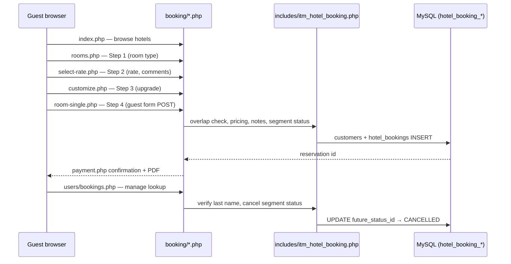

# Hotel Booking Public Portal

Comprehensive review and reference for the guest-facing hotel booking portal under `booking/`, its four-step checkout, manage-reservation flow, ITM admin modules, and shared helpers.

**Agent notes (folder):** `booking/AGENT_NOTES.md` — entry points and file layout.  
**Helpers:** `includes/itm_hotel_booking.php` (loaded from `config/config.php`).

---

## 1. Intent & purpose

The **public booking portal** (`booking/`) lets guests browse hotels, select dates and rooms, complete a four-step checkout without ITM employee login, and manage an existing reservation with **last name + confirmation number** (`hotel_bookings.id`).

Staff configure inventory, rates, and policies in ITM **Hospitality** modules (`modules/hotel_bookings/`, `modules/hotel_booking_hotels/`, etc.). The portal reads that data through MySQLi helpers scoped by `company_id`.

**Design constraints:**

- Procedural PHP; no separate framework under `booking/`.
- `bootstrap.php` sets `ITM_HOTEL_BOOKING_PUBLIC_PORTAL` so `config/config.php` skips employee login for this tree.
- Single stylesheet: `booking/css/hotel-booking-modern.css`.
- No online payment gateway — confirmation states **Payment at the hotel**.

---

## 2. Architecture overview



### Bootstrap & tenant

| Piece | Role |
|-------|------|
| `booking/bootstrap.php` | Session, `ITM_HOTEL_BOOKING_PUBLIC_PORTAL`, `APPURL`, `hb_public_company_id()`, `hb_load_active_hotel_row()` |
| `hb_public_company_id()` | Welcome copy / default portal tenant (session `company_id` or first `public_portal_enabled` among companies 1–5) |
| `hb_load_active_hotel_row()` | Active hotel by `id` across all companies (used by `rooms.php`, `calendar.php`) |
| `config/config.php` | Shared DB connection, CSRF, date helpers |

### Shared portal includes

| File | Role |
|------|------|
| `includes/portal_chrome.php` | Header, stay bar, money format, amenity icons, guest rating block |
| `includes/portal_checkout.php` | Stepper, reservation summary, payment confirmation, manage-booking aside actions |
| `includes/portal_room_detail.php` | Room-type detail modal markup (Steps 1 & 3) |

### Front-end assets

| Asset | Used on |
|-------|---------|
| `hotel-booking-public.js` | `index.php` — hotel detail modal, gallery |
| `hotel-booking-dates.js` | `index.php` — Select Dates modal (check-in + check-out range; **◀ / ▶** month nav; auto-advance to next month when check-in is in the last week) |
| `hotel-booking-amenity-icons.js` | Amenity SVG resolution |
| `hotel-booking-select-room.js` | `rooms.php` — filters, occupancy/rates modals, room detail |
| `hotel-booking-customize.js` | `rooms/customize.php` — upgrade totals, room detail modal |
| `hotel-booking-confirmation-pdf.js` | Confirmation PDF (html2canvas + jsPDF) |
| `hotel-booking-change-booking.js` | Manage booking — hotel contacts modal |

Hotel photos are managed in **Hotels** (`modules/hotel_booking_hotels/`). **Room gallery images are managed per room type** in **Room Types** (`modules/booking_rooms_types/`). Files live under `booking/images/{hotel_id}/hotel_photos/` and `booking/images/{hotel_id}/room_types_photos/`; the portal serves them as `APPURL/images/{hotel_id}/…`. Static amenity SVGs remain under `booking/images/amenities/` only.

---

## 3. Guest flows

### A. New booking (4 steps)

| Step | URL | Summary |
|------|-----|---------|
| 0 | [index.php](http://localhost/it-management/booking/index.php) | Hotel list (all active hotels, all companies); detail modal; **Select Dates** (1 night = single check-in; range = multi-night) |
| 1 | [rooms.php](http://localhost/it-management/booking/rooms.php) | Room types, special rates, filters, occupancy |
| 2 | [rooms/select-rate.php](http://localhost/it-management/booking/rooms/select-rate.php) | Room-only vs breakfast, pets, special requests |
| 3 | [rooms/customize.php](http://localhost/it-management/booking/rooms/customize.php) | Optional room upgrade; reservation summary sidebar |
| 4 | [rooms/room-single.php](http://localhost/it-management/booking/rooms/room-single.php) | Guest name, email, phone (E.164); creates booking |
| — | [rooms/payment.php](http://localhost/it-management/booking/rooms/payment.php) | Confirmation, PDF download, manage link |

Draft state (dates, rate, occupancy, upgrade) is stored in session via `itm_hotel_booking_portal_draft_*` helpers until step 4 succeeds.

**Pricing:** nightly room charges use `hotel_booking_rooms.price_per_night` plus per-hotel portal rules on `hotel_booking_hotels` (breakfast adult/child add-on, child nightly supplement, extra-adult %, pet daily fee — edited in **Portal Rate Plans** admin, not hardcoded in `booking/`). Special-rate discount % comes from `hotel_booking_special_rates`. Tourist tax is company-level (`hotel_booking_settings.tourist_tax_per_person_per_night`, default €2/guest/night in seeds). Breakdown: `itm_hotel_booking_portal_checkout_breakdown()` → `itm_hotel_booking_portal_hotel_pricing()`.

**Availability:** `itm_hotel_booking_has_overlap()` blocks double-booking; cancelled bookings are excluded from overlap.

### B. Manage existing reservation

[users/bookings.php](http://localhost/it-management/booking/users/bookings.php) — guest enters **last name** + **reservation ID** (no account required).

After lookup:

- Main column: same confirmation card as `payment.php` (room **type** title without room number).
- **Cancelled** stays: red header (`Reservation cancelled`), status badge, no PDF save.
- Stay bar: hotel, dates, occupancy; **Edit stay** links back to date picker on home (checkout flow uses the same control).
- Aside actions:
  - **Cancellation policy** — opens per-rate HTML under `booking/cancellation_policy/` (configurable in Portal Rate Plans).
  - **Change booking** — modal with hotel name, directions (Google Maps), website, phone.
  - **Cancel Booking** — future segment only; sets segment status to `CANCELLED` (CSRF + re-verify last name).

### C. Optional portal accounts

`auth/login.php`, `register.php`, `logout.php` — `hotel_booking_portal_users` linked to `customers`. **Not required** for browse/book/manage-by-confirmation-number.

### D. Calendar API

`calendar.php` — JSON nightly rates for the date modal (`itm_hotel_booking_hotel_calendar_month()`).

---

## 4. Database model (portal-relevant)

| Table | Portal use |
|-------|------------|
| `hotel_booking_settings` | `public_portal_enabled`, welcome copy, tourist tax, reviews URL |
| `hotel_booking_hotels` | Property name, location, phone, website, currency, check-in/out times, **portal step pricing** (`portal_breakfast_*`, `portal_child_nightly_supplement`, `portal_extra_adult_supplement_percent`, `portal_pet_daily_fee`) |
| `hotel_booking_rooms` | Inventory, `price_per_night`, link to room type |
| `booking_rooms_types` | Type name, bed summary, upgrade pricing |
| `hotel_bookings` | Reservations; segment status FKs; `notes` (rate plan, occupancy meta, comments) |
| `hotel_bookings_future` / `present` / `history` | Status lookups (`PENDING`, `CANCELLED`, etc.) — no ENUM |
| `customers` | Guest PII; ensured on book via `itm_hotel_booking_ensure_customer_for_portal()` |
| `hotel_booking_portal_rate_plans` | Per-hotel cancellation policy URLs (slots 1–4) |
| `hotel_booking_special_rates` | Member, AAA, promo, etc. — discount % per hotel |
| `hotel_booking_amenities` | Icons (`icon_slug` → `booking/images/amenities/*.svg`) |

**Segment resolution:** `itm_hotel_booking_resolve_segment(check_in, check_out)` picks which status column applies (`future_status_id`, `present_status_id`, `history_status_id`). Online cancel only when segment is `future` and status is not already `CANCELLED`.

**Notes contract:** `itm_hotel_booking_portal_build_booking_notes()` stores rate plan, guest comments, upgrade lines, and a machine-readable occupancy line (`Occupancy: rooms=…`) parsed on confirmation display.

---

## 5. ITM admin modules (Hospitality sidebar)

| Module | Purpose |
|--------|---------|
| `modules/hotel_bookings/` | Planning grid, Future/Present/History boards, booking CRUD |
| `modules/hotel_booking_hotels/` | Properties, photos, nearby places |
| `modules/hotel_booking_rooms/` | Physical rooms |
| `modules/booking_rooms_types/` | Room types, upgrade targets |
| `modules/hotel_booking_settings/` | Portal on/off, welcome text, tourist tax |
| `modules/hotel_booking_portal_rate_plans/` | Cancellation policy URLs per rate slot; **portal step pricing** form per hotel |
| `modules/hotel_booking_special_rates/` | Discount programs per hotel |
| `modules/hotel_booking_amenities/` | Amenity catalog + icon slugs |
| `modules/hotel_booking_room_utilities/` | Room ↔ amenity links |
| `modules/hotel_booking_housekeeping_statuses/` | HK status lookup |
| `modules/hotel_bookings_future` / `present` / `history` | Lifecycle status names |

Fresh schema: `db/01_schema.sql`, seeds `db/02_data.sql`, triggers `db/03_triggers.sql`. Existing DBs: `db/migrations/hotel_booking*.sql` (apply in filename order).

---

## 6. Local development URLs

Open in a **new browser tab** (no employee login required for portal pages):

| Page | URL |
|------|-----|
| Booking home | [http://localhost/it-management/booking/](http://localhost/it-management/booking/) |
| Manage my booking | [http://localhost/it-management/booking/users/bookings.php](http://localhost/it-management/booking/users/bookings.php) |
| Hotel bookings (admin) | [http://localhost/it-management/modules/hotel_bookings/index.php](http://localhost/it-management/modules/hotel_bookings/index.php) |
| Portal rate plans (admin) | [http://localhost/it-management/modules/hotel_booking_portal_rate_plans/](http://localhost/it-management/modules/hotel_booking_portal_rate_plans/) |
| Verify script (CLI) | `php scripts/verify_hotel_booking.php` |

Seed example: company 1 **TechCorp Retreat**, reservation IDs from `hotel_bookings` after a test book.

---

## 7. Review (current state)

### Strengths

- **Clear four-step UX** aligned with major hotel sites; shared stepper and reservation summary reduce duplication.
- **ITM integration** — one database, tenant scoping, audit triggers on admin tables, photo uploads via shared helpers.
- **Manage booking** — lookup without passwords; cancellation policy, change (contact hotel), and online cancel while check-out is still in the future (future and present segments).
- **Legacy cleanup** — removed Colorlib template, PDO admin-panel, and vendored jQuery/Bootstrap; ~37 active portal files remain.
- **Regression script** — `scripts/verify_hotel_booking.php` covers segments, guest match, pricing, cancel helpers, PDF JS.
- **Unicode & dates** — UTF-8 end-to-end; stay dates use hospitality **`d/M/Y`** (`31/Aug/2026`, `01/Oct/2026`) via `itm_format_hotel_date_display()` / `itm_render_hotel_date_input()`; MySQL storage stays `Y-m-d`.

### Gaps & risks

| Area | Notes |
|------|--------|
| **No online payment** | By design; confirmation copy must stay accurate if payment is added later. |
| **Manage auth** | Last name + numeric ID only — weak for high-value reservations; acceptable for demo/internal use. |
| **Fallback room images** | Code references `room-3.jpg`, `room-5.jpg`, `room-6.jpg`, `image_2.jpg` under `booking/images/` but only amenity SVGs exist on disk — broken fallbacks until photos uploaded or assets added. |
| **`hotel_booking_portal_rate_plans`** | Required for cancellation policy links; verify script fails if migration not applied on live DB (`db/migrations/hotel_booking_portal_rate_plans.sql`). |
| **Portal pricing columns** | `hotel_booking_hotels` portal pricing fields — apply `db/migrations/hotel_booking_portal_hotel_pricing.sql` on existing DBs (destructive; back up hotel rows first). |
| **Portal user accounts** | Optional `auth/*` rarely used; logout currently redirects to login, not home (pending UX tweak). |
| **Stay bar on manage** | Shows **Edit stay** (same as checkout) rather than exit/logout — may confuse guests who only wanted to leave manage view. |
| **Occupancy modal on manage** | Stay bar includes occupancy trigger but manage page does not load occupancy modal JS — control is inert there. |
| **Single company in session** | Welcome banner still uses `hb_public_company_id()`; hotel grid is cross-tenant. Booking steps resolve tenant from the selected hotel row. |

### Recommended follow-ups (not implemented here)

1. Add missing default JPG fallbacks or switch fallbacks to amenity-neutral placeholders.
2. Apply `hotel_booking_portal_rate_plans` migration on all environments; keep `01_schema.sql` in sync.
3. On manage booking: **Logout** → `auth/logout.php` → `index.php`; hide or wire occupancy control.
4. Rate-limit manage lookup and cancel POSTs if exposed to the public internet.
5. MBQA browser step for full portal flow (index → payment → manage cancel).

---

## 8. Troubleshooting

| Symptom | Likely cause |
|---------|----------------|
| Empty hotel list | No rows with `hotel_booking_hotels.active = 1` and `deleted_at IS NULL` (any company) |
| Cancellation policy link missing | No `hotel_booking_portal_rate_plans` row or empty `cancellation_policy_url` |
| `verify_hotel_booking.php` fails on rate plans table | Run `db/migrations/hotel_booking_portal_rate_plans.sql` on existing DB |
| Room not available on book | Overlap with non-cancelled booking on same `room_id` |
| Manage lookup fails | Last name must match `customers.name` (case-insensitive token match); ID = `hotel_bookings.id` |
| Cancel button hidden | Stay not in `future` segment or already `CANCELLED` |
| PDF download fails | CDN blocked for html2canvas/jsPDF; check browser console |

### Verification commands

```bash
php scripts/verify_hotel_booking.php
php -l booking/bootstrap.php
php -l booking/includes/portal_checkout.php
php -l booking/users/bookings.php
```

See also `scripts/SCRIPTS.md` — hotel booking section.

---

## 9. Related files (quick index)

```
booking/
├── bootstrap.php
├── index.php, rooms.php, calendar.php
├── rooms/          # Steps 1–4, payment, confirmation-pdf
├── users/bookings.php
├── cancellation_policy/*.html
├── auth/           # Optional portal login
├── includes/       # portal_chrome, portal_checkout, portal_room_detail
├── css/hotel-booking-modern.css
├── js/hotel-booking-*.js
├── images/
│   ├── amenities/*.svg
│   └── {hotel_id}/
│       ├── hotel_photos/       # Hotels admin uploads
│       └── room_types_photos/  # Room Types admin uploads (portal room cards)

includes/itm_hotel_booking.php
modules/hotel_bookings/
scripts/verify_hotel_booking.php
```
