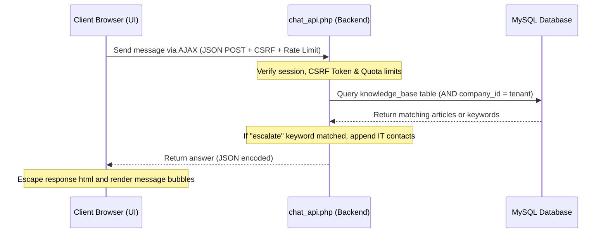

# Floating Technical Assistant Chatbot Subsystem

Comprehensive documentation for the floating technical assistant chatbot widget, multi-tenant Knowledge Base integration, secure communication gates, keyword-based escalation mechanisms, and administrative configuration.

---

## 1. Intent & Purpose

The **Chatbot** subsystem provides real-time, context-aware technical assistance to users directly within the application workspace. It integrates a lightweight, floating user interface with a tenant-scoped knowledge base, enabling rapid resolution of common technical inquiries, troubleshooting guidance, and automated service escalations.

---

## 2. System Architecture & Flow

The chatbot functions as a multi-tenant client-server system, avoiding external API dependencies by leveraging localized database search models:



### Core Components

| Component | Path / Location | Responsibility |
|---|---|---|
| **Frontend Widget** | `js/chatbot.js` | Manages floating button, conversation history states, scroll anchors, and AJAX requests. |
| **Stylesheets** | `css/chatbot.css` | Controls slide-in transitions, message bubbles, active states, and responsive mobile overrides. |
| **API Endpoint** | `modules/knowledge_base/chat_api.php` | Receives queries, verifies access gates, runs tenant-scoped keyword match, and outputs answers. |
| **Knowledge Base** | `modules/knowledge_base/` | Standard CRUD module allowing IT staff to curate articles, tags, and automated keyword responses. |

---

## 3. Security Hardening & Protection Gates

To protect the application from exploitation, the chatbot API enforces three strict security controls:

### A. Cross-Site Scripting (XSS) Prevention
Any dynamic content or bot-supplied string rendered in the conversation window is fully escaped on the client-side. The Javascript renderer inside `js/chatbot.js` wraps conversation nodes in the `escapeHtml()` helper before appending them to the document object model (DOM), neutralizing script execution vectors.

### B. CSRF Token Verification
All chat requests transmitted to `chat_api.php` must include the standard anti-CSRF token. The frontend includes this token within the custom `X-CSRF-Token` HTTP header, and the backend verifies it with the session token before matching queries.

### C. Multi-Tenant Scoping
To prevent cross-tenant data leaks, all knowledge base queries are strictly partitioned:
```sql
SELECT response FROM knowledge_base WHERE company_id = ? AND active = 1 AND (keyword LIKE ? OR question LIKE ?)
```
This ensures a user in Company A can never query or view curated troubleshooting material belonging to Company B.

### D. Rate Limiting Integration
The chatbot API participates in the rolling hour rate-limiting system via `itm_api_enforce_rate_limit_or_exit($conn)`. Free tier requests leverage session-based cookies, while higher tiers require validated keys if integrated outside standard sessions.

---

## 4. Keyword-Based IT Escalation

When the bot's matching logic resolves an answer containing the specific keyword `"escalate"`, the system triggers an automated escalation sequence:
1. The chatbot API reads the active tenant's contact configurations from the `it_settings` table.
2. The bot appends a specialized card containing IT department operational hours, emergency phone extensions, support email addresses, and escalation instructions to its response payload.
3. This guarantees that if a user submits keywords like "escalate", "unresolved", "manager", or "human", they receive a clear path to direct assistance.

---

## 5. Administrative Enable/Disable Toggle

The visibility of the floating chatbot widget is fully configurable per company:
- **Database Column:** `ui_configuration.enable_chatbot` (`TINYINT(1)`).
- **Behavior:** The global layout engine (`includes/header.php` and `includes/sidebar.php`) reads the active company configuration. If `enable_chatbot` is disabled (`0`), the widget script and stylesheets are not loaded, and the chatbot remains entirely hidden for all tenant users.

---

## 6. Verifications & Operational Diagnostics

To verify the chatbot's communication endpoints, keyword matching, and multi-tenant scoping integrity, run the verification script from the repository root:

```bash
# Verify API response codes, XSS escaping, CSRF blocks, and IT escalation triggers
php scripts/verify_chatbot.php
```
