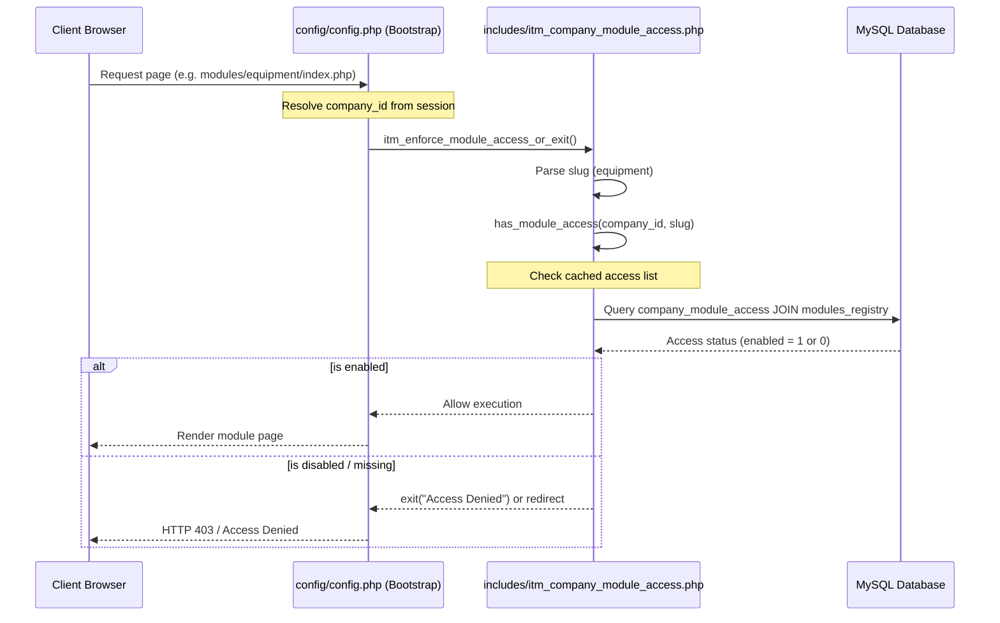

# Company Module Access Subsystem

Comprehensive documentation for the administrator-only Company Module Access matrix, global modules registry, multi-tenant request filtration, and automatic sidebar discovery mechanisms.

---

## 1. Intent & Purpose

The **Company Module Access** subsystem (`modules/company_module_access/`) is a core governance interface. It allows system administrators to dynamically enable or disable features per company tenant. This provides:
- Granular control over the modules available to each company.
- Multi-tenant isolation at the feature level.
- Automated registration of newly deployed modules.
- Customizable sidebar icons per tenant company.

---

## 2. System Architecture & Flow

Feature visibility is evaluated globally on every web request, integrating directory-scanning discovery and database lookups before rendering UI components:



---

## 3. Database Schema & Tables

The subsystem manages feature visibility across two primary tables:

| Table | Primary Role | Scope / Type |
|---|---|---|
| **`modules_registry`** | Global catalog of all discovered or registered module slugs and their default system-wide configuration. | Global (all tenants) |
| **`company_module_access`** | Tenant-specific access map. Tracks the `enabled` state and customized sidebar emoji per module per company. | `company_id` |

### Key Columns & Constraints

- **`company_module_access.enabled`:** `TINYINT(1)` flag. When set to `0`, access is denied to all non-administrator users of the respective company.
- **`company_module_access.icon`:** `VARCHAR` emoji code override. Allows a specific company to override the default sidebar icon for that module.
- **`modules_registry.module_slug`:** The unique folder slug (e.g., `equipment`) which maps 1:1 with URL directory paths.

---

## 4. Business Rules & Access Controls

### A. Central Access Enforcement
Rather than requiring duplicate checks inside individual module controller files, enforcement is managed centrally:
1. On bootstrap, `config/config.php` extracts the requested path's module slug.
2. It invokes `itm_enforce_module_access_or_exit($conn)`.
3. If the module is explicitly disabled (`enabled = 0`) for the current company, the request is terminated with a generic access error.

### B. Opt-Out Access Policy
- If no row exists in `company_module_access` for a registered module and company, the system treats it as **enabled by default** (opt-out model).
- This prevents new features from being blocked for existing companies until a manual toggle occurs.
- On the first evaluation, the prefetch helper `itm_ensure_company_module_access_for_company()` inserts missing pairings with `enabled = 1` to ensure consistency.

### C. System & Administrator Exemptions
- Modules configured as system-level features (such as `settings` or `company_module_access` itself) are exempted from tenant-level blocks for administrator-level employees (`itm_is_admin()`).
- Regular roles are strictly bound by the visibility matrix.

### D. Sorting and Emoji Precedence
- **Stable Sort Order:** In all admin listings and registries, items are sorted by `module_slug ASC` (e.g. alphabetical folder name) rather than `module_name`, which ensures a stable matrix order and avoids sorting issues caused by emoji prefixes.
- **Icon Priority Cascade:** The icon rendered in the navigation sidebar resolves via the following precedence:
  1. User-specific sidebar preferences (`ui_configuration.module_icon_overrides`).
  2. Company-level icon override (`company_module_access.icon`).
  3. Default registered icon (`modules_registry.icon`).
  4. Global catalog fallback (`itm_sidebar_item_catalog()`).

---

## 5. UI Layout & Dynamic Matrix

Administrators manage company access using a specialized double-table interface:

1. **The Matrix View (`index.php`):**
   - Renders a grid listing all registered modules down the rows and all active companies across the columns.
   - Cells display dynamic checkboxes with explicit binary state indicators (`1` = ✅, `0` = ❌ only) for clarity.
   - Provides administrative controls for bulk toggling (Select All, Cancel, Unselect All).
   - Lists *all* modules, including system-level and inactive registries (which render disabled checkboxes) to maintain complete transparency.
2. **Global Registry List (`list_all.php`):**
   - Flat CRUD index listing each registered module, its category, system status, and active state.

---

## 6. Dynamic Sidebar & Auto-Registration

To minimize manual configuration, the system implements **Auto-Registration** and **Self-Discovery**:
- **Scanning Discovery:** When loading the sidebar, `itm_merge_registry_modules_into_sidebar_discovery()` scans three sources:
  1. Real directories under `modules/*/index.php`.
  2. Active tables via `SHOW TABLES` (for auto-scaffolded tables).
  3. Existing rows in the global `modules_registry`.
- **Automatic Upsert:** If a new folder or scaffold is discovered that does not exist in the database, `itm_ensure_registry_rows_for_module_slugs()` dynamically creates the registry entry and provisions default `company_module_access` rows on-the-fly, allowing the feature to appear in the live sidebar immediately without manual index syncs.

---

## 7. API Actions

The Matrix interface utilizes internal AJAX endpoints inside `index.php` to perform blur-saves and bulk updates securely. All operations require `itm_require_post_csrf()` and administrative privileges.

### `ajax_action=toggle_access` (POST)
- **Parameters:** `company_id` (int), `module_id` (int), `enabled` (0 or 1)
- **Behavior:** Updates `company_module_access` and invalidates the localized request cache to apply changes instantly.

### `ajax_action=set_icon` (POST)
- **Parameters:** `company_id` (int), `module_id` (int), `icon` (string)
- **Behavior:** Stores or clears the custom company sidebar emoji.

### `ajax_action=bulk_toggle_access` (POST)
- **Parameters:** `pairs_json` (serialized payload of toggled keys)
- **Behavior:** Atomically updates multiple visibility states in a single batch.

---

## 8. Related Files & Components

| Path | Primary Role |
|---|---|
| `modules/company_module_access/index.php` | Renders the admin matrix grid and hosts the AJAX API handlers. |
| `modules/company_module_access/list_all.php` | Flat registry list for managing individual modules. |
| `includes/itm_company_module_access.php` | Core visibility check helpers, caching layers, and database access functions. |
| `js/company-module-access-matrix.js` | Client-side click binds, bulk selections, and AJAX event handlers. |

---

## 9. Troubleshooting & Diagnostics

### Common Pitfalls
- **Module Missing from Matrix:** If a newly created module does not show up in the admin matrix, run `php scripts/sync_modules_registry.php` to force-register files and synchronize directory catalogs.
- **Accidental Admin Lockout:** The system explicitly guards core system modules (like `settings`) from being locked out. Do not manually edit DB rows to disable `settings` or `company_module_access` for admin companies.

### Automated Verification
To verify matrix integrity, test permission constraints, and audit multi-tenant access boundaries, run from the repository root:

```bash
php scripts/verify_company_module_access.php
```
