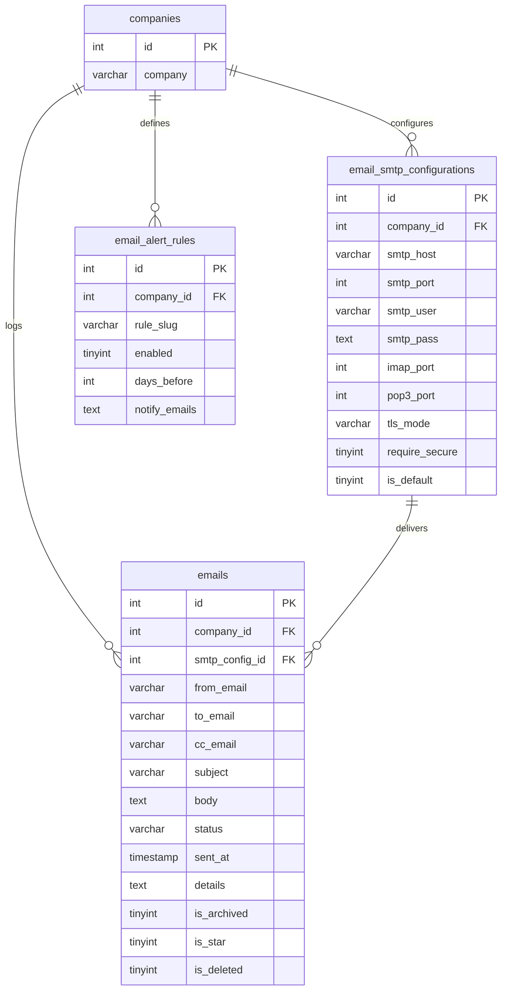
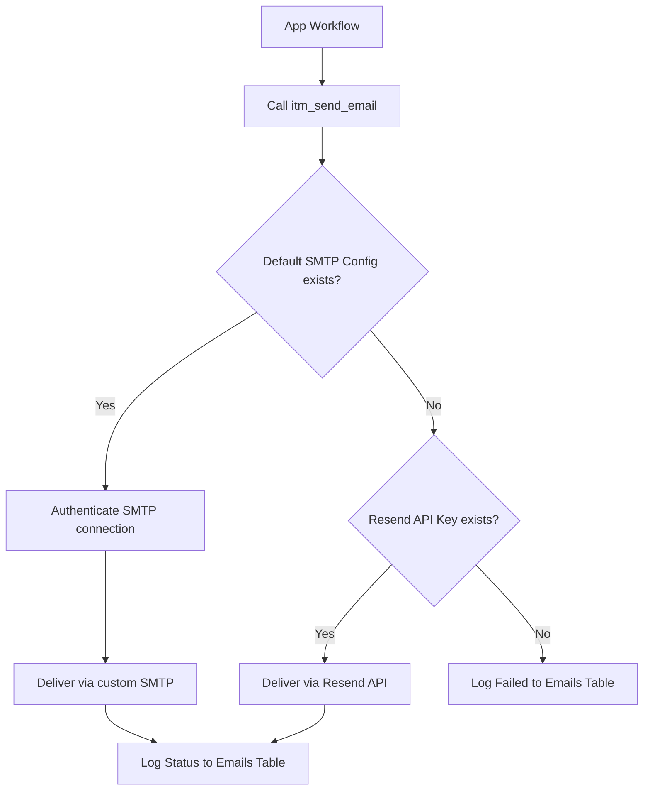

# Tenant Email Management & Alert Workflows

Multi-tenant email management system supporting custom SMTP configurations, detailed send logs, automated expiration alert rules, and transactional HTML templates.

---

## 1. Intent & Purpose

The **Email Management** module (`modules/emails/`) provides a centralized, secure service for all transactional and automated emails sent within the platform. Rather than using static server configurations, the system empowers each tenant company to register its own SMTP transports and establish rule-driven alerts for expiring assets, warranties, and task deadlines.

---

## 2. Key Database Tables & Schema

The email management system relies on three primary tables:



### Table Schema Details

| Table | Column | Type / Constraints | Role |
|---|---|---|---|
| **`email_smtp_configurations`** | `smtp_pass` | `TEXT` | Encrypted at rest via the internal `itm_email_encrypt_password()` helper. |
| | `imap_host` | `VARCHAR(255)` NULL | IMAP server for inbound ticket polling (paired with `imap_port`). |
| | `inbound_ticket_enabled` | `TINYINT DEFAULT 0` | When `1` on the default profile, `run_inbound_email_tickets.php` polls the mailbox. |
| | `is_default` | `TINYINT(1) DEFAULT 0` | Exactly one active profile per company is designated as the default transport. |
| **`ticket_inbound_email_messages`** | `message_id` | `VARCHAR(255)` | RFC Message-ID dedupe per `company_id`; links optional `ticket_id` / `email_log_id`. |
| **`emails`** | `status` | `VARCHAR(50)` | Delivery states: `sent`, `failed`, or `received`. |
| | `is_archived`, `is_deleted` | `TINYINT(1) DEFAULT 0` | Controls visibility in Send Logs view. Soft-delete flips `is_deleted = 1`. |
| **`email_alert_rules`** | `rule_slug` | `VARCHAR(100)` | Expiration types: `warranty`, `license`, `certificate`, `alerts`, `notes`, `todo`, `events`. |

---

## 3. Core Delivery Architecture

Transactional and automated emails always route through `itm_send_email()` in `includes/itm_email.php`.



### Resend API Fallback
If a company has not configured an active, default SMTP profile, the delivery helper falls back to the system-wide Resend configuration loaded from the `RESEND_API_KEY` environment variable.

---

## 4. Transactional HTML Templates

HTML bodies sent via the platform are automatically wrapped in a clean, responsive layout.

### Wrapped Structure
By default, standard text fragments are injected into the transactional template inside `includes/itm_email.php`.

```php
// Standard invocation
require_once ROOT_PATH . 'includes/itm_email.php';

$to = 'engineer@techcorp.com';
$subject = 'Onboarding Request Approved';
$htmlContent = '<p>Your IT onboarding request has been fully authorized.</p>';

itm_send_email($to, $subject, $htmlContent, $company_id, [
    'email_template' => [
        'subtitle' => 'Access Provisioned',
        'button_text' => 'Login to ITM',
        'button_url' => BASE_URL . 'login.php',
    ]
]);
```

### Raw Format
To bypass the HTML wrapper completely (for example, when sending raw Markdown, pre-formatted tables, or custom layouts), pass `email_template => false` in the optional parameter array.

---

## 5. Automated Expiration Alert Rules

The system includes an automated alert dispatcher script designed for cron scheduling:

- **Command:** `php scripts/run_email_alert_rules.php`

### Rule Types & Target Objects
The dispatcher matches records against tenant-active rules in `email_alert_rules` based on their slugs:

| Rule Slug | Source Fields | Notification Behavior |
|---|---|---|
| `warranty` | `equipment.warranty_expiry` | Alerts matching `notify_emails` when `warranty_expiry` is exactly `days_before` from today. |
| `license` | `license_management.expiry_date` | Alerts for software license expirations. |
| `certificate` | `equipment.certificate_expiry` | Alerts for hardware certificate expirations. |
| `alerts`, `notes`, `todo`, `events` | Expiry metrics / deadlines | Triggers customized notices based on rules. |

---

## 5b. Inbound email → tickets

Per-tenant helpdesk intake polls each company's **default SMTP profile** when **Create tickets from inbound mail** is enabled (`email_smtp_configurations.inbound_ticket_enabled`).

- **Routing address:** `companies.email` (e.g. `info@techcorp.example`) — senders should use this To address; the runner logs a warning when To/Cc does not include it but still processes under the profile's `company_id`.
- **Runner:** `php scripts/run_inbound_email_tickets.php` (schedule via cron; optional `--company=1`, `--verbose`, `--dry-run`).
- **Threading:** replies with `TCK-####` or `[#id]` in the subject append `ticket_comments` instead of creating a duplicate ticket.
- **Dedupe:** `ticket_inbound_email_messages` stores RFC Message-ID per company.
- **Regression:** `php scripts/verify_inbound_email_tickets.php` (includes live Mailpit E2E when the API responds).
- **Manual test send:** `php scripts/send_mailpit_inbound_test_email.php --company=1` (optional `--process` to create a ticket immediately).

### Local Mailpit (Laragon / Dunebox)

Mailpit has **no IMAP**. For local dev, set **`imap_host` = `mailpit`** on the default SMTP profile (fresh seeds in `db/02_data.sql`, or `php scripts/apply_mailpit_inbound_email_config.php --apply`).

| Path | Value |
|------|--------|
| Web UI | [http://localhost/mailpit/](http://localhost/mailpit/) |
| Inbound API | `http://localhost/mailpit/api/v1` (override with env `ITM_MAILPIT_API_URL`) |
| Outbound SMTP | `127.0.0.1:1025` (override with `ITM_MAILPIT_SMTP_HOST` / `ITM_MAILPIT_SMTP_PORT`) |

The runner lists unread messages via the Mailpit HTTP API instead of `imap_open()` when `imap_host` is `mailpit` or an `http(s)://…/mailpit` URL. **Dedupe** uses `ticket_inbound_email_messages` — opening a message in the Mailpit UI (Read flag) does not block ticket creation.

### Production IMAP mailboxes

When `imap_host` is a real mailbox hostname, polling uses PHP **`imap_open()`** on the **CLI** binary used for cron (not required for outbound SMTP, Mailpit profiles, or `verify_emails_module.php`).

1. Locate the **CLI** `php.ini` beside the `php.exe` you use for `scripts/run_inbound_email_tickets.php` (Dunebox: `D:\dunebox-v1.0.6\system\apps\php\php-7.4.33-nts-Win32-vc15-x64\php.ini`).
2. Ensure `php_imap.dll` exists under the `ext\` folder (copy from Laragon portable `bin\php\php-7.4.33-…\ext\` when missing on Dunebox).
3. Add or uncomment: `extension=imap`
4. Verify:

```powershell
& "D:\dunebox-v1.0.6\system\apps\php\php-7.4.33-nts-Win32-vc15-x64\php.exe" -r "echo function_exists('imap_open') ? 'imap ok' : 'imap missing';"
```

Canonical Dunebox template: `scripts/data/php.ini.dunebox-7.4.template` (applied by `scripts/setup_dunebox_php_from_laragon.ps1`).

---

## 6. Business Rules & Security

### A. Credentials Security
- SMTP passwords must never be stored in plaintext. They are encrypted before storage via `itm_email_encrypt_password()` and decrypted at runtime via `itm_decrypt()` using the server's unique SMTP encryption key.

### B. Audit Log Exemption
- The **`emails`** send/receive log represents private communication.
- To protect user PII and confidential contents, the `emails` table is strictly **exempt** from standard database audit triggers (`trg_*_audit_*`) and does not register mutations to `audit_logs`.
- SMTP profile configurations (`email_smtp_configurations`) and alert rules (`email_alert_rules`) remain fully auditable.

### C. Default Routing Constraints
- Only one SMTP configuration row can be marked as default (`is_default = 1`) per tenant. Saving or editing an SMTP configuration and marking it as default automatically clears the default status from other SMTP configurations for that company.

---

## 7. Verification & Operational Diagnostics

### Troubleshooting Commands

To perform localized delivery testing or trigger alert dispatchers manually, execute the CLI diagnostic tools from the repository root:

1. **Verify full email module workflows:**
   ```bash
   php scripts/verify_emails_module.php
   ```

2. **Trigger the automated alert engine manually:**
   ```bash
   php scripts/run_email_alert_rules.php --verbose
   ```

3. **Verify registration welcoming mail dispatch:**
   ```bash
   php scripts/test_register_mail.php email=your-test@example.com
   ```

4. **Verify password reset delivery flow:**
   ```bash
   php scripts/test_email_forgot.php email=your-test@example.com
   ```

5. **Poll inbound mailboxes for ticket creation (requires PHP `imap` on CLI):**
   ```bash
   php scripts/run_inbound_email_tickets.php --verbose
   php scripts/verify_inbound_email_tickets.php
   ```
