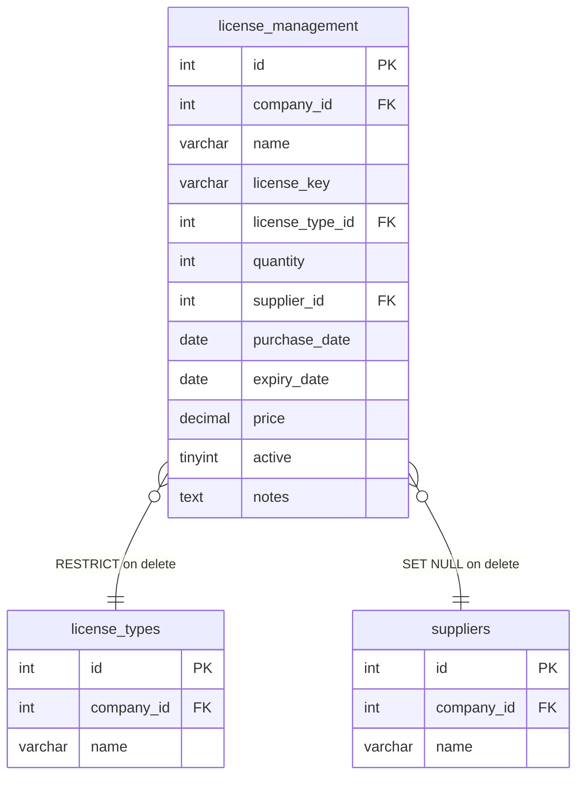

# License Management Subsystem

Comprehensive documentation for the software license tracking module, database schemas, price normalization, localized date controls, soft-delete audit structures, and QA execution.

---

## 1. Intent & Purpose

The **License Management** module (`modules/license_management/`) is designed to track software licenses per company. It facilitates audit readiness, cost tracking, and subscription renewal management by:
- Centralizing software keys, type scopes, pricing, and purchase/expiry timelines.
- Providing standardized import/export operations for license assets.
- Automatically validating pricing metrics and relationship integrity.

---

## 2. System Architecture & Relationships

The license management module operates on standard multi-tenant CRUD patterns, referencing lookups and supplier entities:



### Table Relationships & Delete Handlers

- **License Type Integration:** Reference lookup table `license_types` (values like `Per User`, `Per Device`, `Enterprise`, `Subscription`, `Other`). Deleting an active lookup row referenced by a license record is blocked via `RESTRICT` foreign key rules.
- **Supplier Assignment:** Reference lookup table `suppliers`. Deleting a supplier Nulls the `supplier_id` column of related licenses (`SET NULL` rule).

---

## 3. Business Rules & Validation Constraints

### A. Field Defaults & Rules
- **Name Field:** A non-empty name (`name` NOT NULL) is required on create and edit.
- **Quantity Metric:** If omitted on submission or import, `quantity` defaults to `1`.
- **Active State:** Employs the double-label checkbox pattern for form edits. Displays active/inactive badges on index lists (no emojis are rendered inside badges).

### B. Price Normalization
- To ensure decimal compatibility, pricing input parses both periods and commas.
- **Process:** Commas are converted to periods (`cr_normalize_price_input()`) prior to applying numerical verification (`cr_validate_numeric_value()`), preventing database save failures on European formatting.

### C. Localized Date Formatting
- **Display Style:** Dates are presented in a user-friendly `dd/mmm/yyyy` format in list views, detail screens, and excel exports.
- **MySQL Conversion:** Inputs are parsed back to MySQL's standard `YYYY-MM-DD` representation via `itm_parse_date_input()` before query execution.

---

## 4. UI Layout & Entry Forms

The module follows standard flattened CRUD patterns, featuring:

1. **Grid Views (`index.php`):**
   - Hides raw foreign key IDs, substituting human-readable Type and Supplier labels resolved via the lookup helper `itm_fk_label_by_id()`.
   - Incorporates search filtering, column sorting indicators (▲/▼), and server-side pagination with emoji-only anchors (⏮️, ◀️, ▶️, ⏭️).
   - Supports bulk-delete and table-clearing actions when matching page thresholds.
2. **Form Layout Order (`create.php` / `edit.php`):**
   - Inputs are organized sequentially: Name, License Key, Type, Quantity, Supplier, Purchase Date, Expiry Date, Price, Active Checkbox, Notes.
   - Company ID is strictly hidden from view.

---

## 5. Soft-Delete & Audit Meta Integration

To satisfy corporate logging standards, the module integrates standard audit fields:
- **Deletion:** Deleting a row performs a soft-delete rather than a hard query. The delete handler sets `active = 0`, stamps `deleted_by` with the session user ID, and logs the deletion timestamp in `deleted_at`.
- **View Screen Metadata:** Detailed views (`view.php`) display the six compliance fields (Created by, Created at, Updated by, Updated at, Deleted by, Deleted at) rendered with full employee names instead of raw numeric IDs.

---

## 6. Import / Export Specifications

The module integrates with standard table-tool utilities to facilitate bulk data migrations:
- **Import Excel Endpoint:** Features a JSON endpoint on `index.php` matching `data-itm-db-import-endpoint="index.php"`, enabling direct Excel-to-database imports.
- **Custom Header Normalization:** Column normalization converts localized headers and decimal formats on-the-fly during parsing.

---

## 7. Troubleshooting & Operational Verification

### Common Pitfalls
- **Mismatched Lookup Seeds:** If `license_types` are missing for a newly created company tenant, lookup fields may render empty. Default seeds are auto-copied via database triggers during company registration.
- **Save Failures on Commas:** Ensure price fields are normalized correctly; hand-crafted query bypasses that skip `cr_normalize_price_input()` will fail if given a comma-separated price.

### Automated Browser QA
To execute headless browser smoke tests and confirm CRUD capability, validation constraints, and Excel import paths, run from the repository root:

```bash
php scripts/module_browser_qa_runner.php --module=license_management --company=1
```
