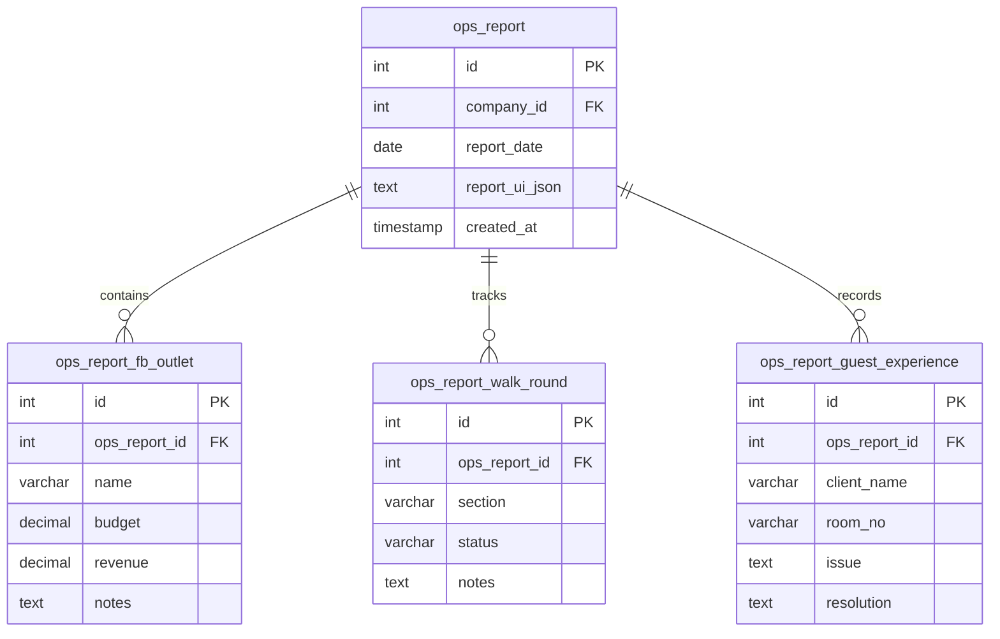

# Daily Ops Report & Dynamic UI Modeling

Technical documentation for the multi-section Daily Ops Report module, auto-population mechanisms, role-restricted history locks (D-2 rule), and dynamic UI label modeling stored in database JSON.

---

## 1. Intent & Purpose

The **Ops Report** module (`modules/ops_report/`) acts as a daily hotel operations ledger. It compiles critical operations metrics—duty managers, guest feedback, Night Shift logs, F&B outlet revenues, and custom walk-round inspections—into a single daily header. The subsystem features a hybrid architecture combining static structural layouts with fully dynamic, operator-editable UI labels stored inline within the database.

---

## 2. Key Database Tables & Schema

The Ops Report uses a parent-child relational layout to capture multi-section daily logs:



### Table Schema Highlights

| Table | Column | Type / Constraints | Role |
|---|---|---|---|
| **`ops_report`** | `report_ui_json` | `LONGTEXT` | Stores localized section headers, button titles, and custom labels (dynamic UI modeling). |
| **`ops_report_fb_outlet`** | `budget`, `revenue` | `DECIMAL(10,2)` | Numeric financial fields supporting localized dot/comma normalization. |
| **`ops_report_walk_round`** | `status` | `VARCHAR(50)` | Inspected area statuses (e.g. OK, Warning, Critical). |

---

## 3. Auto-Population & Ensuring Daily Records

When an operator opens a specific date for the first time:
1. The calendar day/month/year selectors route the query parameters to `index.php`.
2. The core handler calls `opr_ensure_report()`.
3. If no record exists for that date, the system inserts a parent header row under `ops_report` for the active company.
4. It automatically populates default child rows (F&B outlets, walk-round inspection points, and duty managers) copying default labels from the active template. This ensures the operator is immediately presented with a fully populated grid ready for entry, eliminating blank-page friction.

---

## 4. Edit Locking & Access Control (D-2 Rule)

To protect financial audits and historical operational logs from retrospective manipulation, the system enforces a strict time-based lock:

- **D-2 Edit Lock:** Standard (non-admin) users can only edit logs for **today and yesterday**:
  ```php
  $is_unlocked = ($report_date > date('Y-m-d', strtotime('-2 days')));
  ```
- **Read-Only Mode:** If a report date is older than two days (`<= today - 2 days`), the entire form is rendered read-only, and any incoming POST edits or deletes are rejected for non-administrators.
- **Administrator Bypass:** Global or company administrators (`itm_is_admin()`) are fully exempted from this rule and can edit or delete historical report entries for any date.

---

## 5. Dynamic UI Modeling (`report_ui_json`)

A unique characteristic of the Ops Report is that **UI labels themselves are data**. 
- Curated titles (such as "Duty Managers", "Guest Experience", "Night Shift", "F&B Outlets", and individual field headers) are loaded from `ops_report.report_ui_json`.
- **Inline Editing:** Operators can click directly on headers or titles and modify them. On blur, the changes are saved via an AJAX request, updating `report_ui_json`.
- **Formatting Fallbacks:** Hardcoded layout regions (e.g., date formats, company information, and action bars) are preserved, while specific labels and button text remain customizable on a per-tenant basis.

---

## 6. Cascade Deletion & Audit Trail

### Cascade Deletion
When a parent daily report is deleted, all dependent entries in F&B Outlets, Guest Experiences, Night Shift, and Walk-Rounds are cascaded and deleted automatically from the database.

### Audit Trigger Integration
Unlike private modules, every table under the Ops Report ecosystem is fully audited. The database defines insert, update, and delete triggers (`trg_ops_report*_audit_*`) in `db/03_triggers.sql`. 
- To maintain context, child table triggers automatically include the parent `ops_report_id` in their audit JSON payloads, allowing auditors to trace modifications back to the exact operations date.

---

## 7. Verification & Operational Diagnostics

Run the following test tools from the repository root to verify Ops Report auto-generation, D-2 locking thresholds, cascade deletion, and audit logging integrity:

```bash
# Verify Ops Report auto-creation, D-2 edit locks, cascade deletes, and audit log coverage
php scripts/verify_ops_report.php
```
