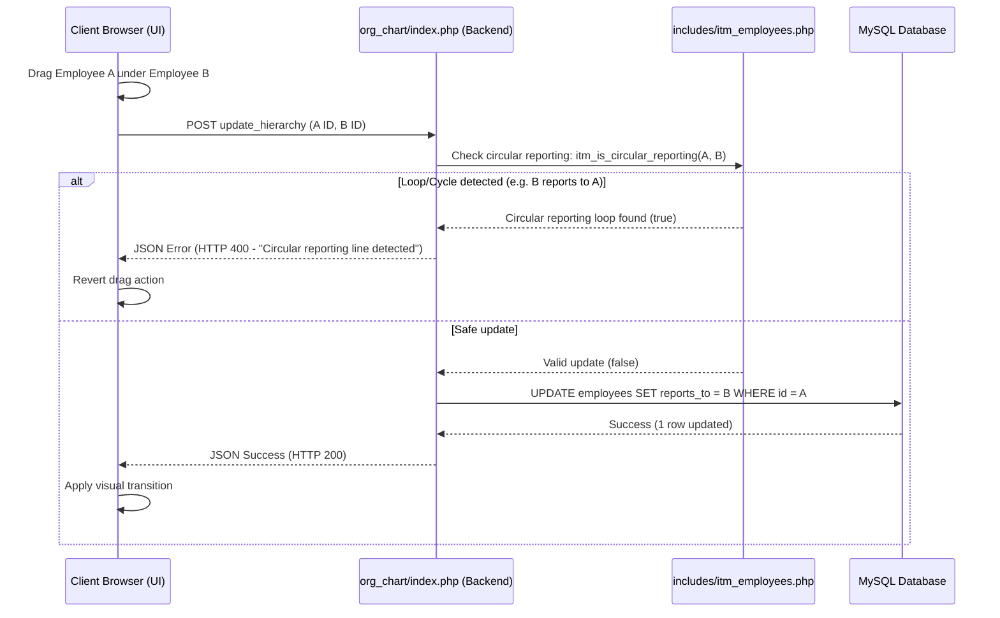
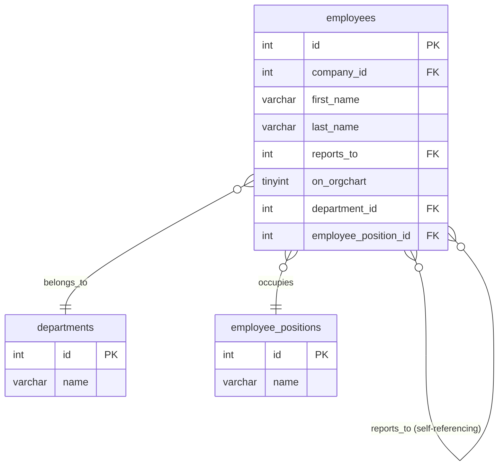

# Org Chart and Hierarchy Subsystem

Comprehensive documentation for the interactive organizational chart, self-referencing reporting structures, recursive cycle detection, dynamic drag-and-drop hierarchy persistence, and responsive UI behaviors.

---

## 1. Intent & Purpose

The **Org Chart** subsystem (`modules/org_chart/`) provides a visual, real-time, and interactive diagram of the company's reporting hierarchy. It serves as an organizational roadmap that:
- Illustrates reporting relationships and reporting spans dynamically.
- Enables fluid restructuring of teams through intuitive drag-and-drop interfaces.
- Strictly guards against reporting anomalies (such as self-reporting or circular reporting lines).

---

## 2. System Architecture & Flow

The Org Chart uses a self-referencing hierarchy pattern coupled with immediate AJAX persistence and cycle safety guards:



---

## 3. Database Schema & Relationships

All hierarchy relationships are managed as self-referencing links on the core employee data table:



### Table Relationships & Column Roles

- **`employees.reports_to`:** Self-referencing FK column pointing to `employees.id`. Determines the parent node of each employee node in the chart tree. A value of `0` or `NULL` defines a top-level node (usually the Managing Director or Company President).
- **`employees.on_orgchart`:** `TINYINT(1)` visibility flag. Employees with `on_orgchart = 0` are excluded from rendering in the tree structure.
- **Reference Labels:** Node metadata (like department names and position titles) is resolved dynamically via relationships to `departments` and `employee_positions`.

---

## 4. Business Rules & Access Controls

### A. Employee Eligibility Filter
To prevent cluttering the operational chart with inactive staff or contractors, nodes are restricted to employees who are:
- Scoped strictly to the active `company_id`.
- Configured with `on_orgchart = 1` and are currently active within HR status records.

### B. Recursive Cycle Detection (Mandatory)
Before committing any reporting change to the database, the backend executes recursive cycle detection (`itm_is_circular_reporting()`).
- **The Rule:** No employee node can be reparented to report to themselves, nor can they report to any node that exists within their own downstream reporting subtree.
- **Example:** If Employee A manages Employee B, reparenting Employee A to report to Employee B is rejected instantly to prevent infinite tree traversal loops.

### C. Drag-and-Drop AJAX Persistence
- Hierarchy changes made via the interactive UI are saved immediately.
- The browser triggers a background `POST` request, and the tree layout is kept synchronized without requiring a manual page reload.

---

## 5. UI Layout & Responsive Visualizer

The Org Chart is a bespoke visualizer and bypasses standard tabular grids:
- **Responsive Viewport:** Features a scale-to-fit tree container. Under `768px` screens, nodes automatically scale down to `min(240px, 80vw)` and toolbar elements wrap cleanly to ensure layout stability on mobile devices.
- **Custom Client-Side Exports:**
  - **Image Export:** Utilizes `html2canvas` to capture the visual tree structure and export it as a PNG file.
  - **Excel Structure Export:** Exports the hierarchical relationships as a structured list.
- **UI Bypass Gates:** Since the org chart utilizes a bespoke canvas drawing flow, it is explicitly exempt from standard tabular features (such as bulk select toolbars, search forms, and column sort toggles) as reviewed under system configuration rules.

---

## 6. API Actions

Interaction between the drag-and-drop canvas and the backend database is mediated by internal actions inside `modules/org_chart/index.php`.

### `action=update_hierarchy` (POST)
- **Parameters:** `employee_id` (int), `reports_to` (int - target parent ID or `0` for top-level)
- **Behavior:**
  1. Runs `itm_is_circular_reporting($employeeMap, $reportsTo, $employeeId)` cycle check.
  2. If clean, performs `UPDATE employees SET reports_to = ? WHERE id = ? AND company_id = ?`.
  3. Returns a JSON response with status and state flags.

---

## 7. Related Files & Components

| Path | Primary Role |
|---|---|
| `modules/org_chart/index.php` | Main entry point hosting the visual tree viewer, cycle checks, and the AJAX update handler. |
| `includes/itm_employees.php` | Defines the recursive circular reporting helper `itm_is_circular_reporting()`. |

---

## 8. Troubleshooting & Diagnostics

### Common Pitfalls
- **Missing Nodes:** If an employee is missing from the tree view, confirm that `on_orgchart` is set to `1` in the employee's profile and that they have a valid active employment status.
- **Circular Reference Locks:** If a drag-and-drop action is continuously rejected, inspect the reporting chain for existing loops. A loop in the DB can block further updates until resolved.

### Visual Regression Tests
To capture clean, representative snapshots of the company tree for README assets, execute the Playwright screenshot tool:

```bash
ITM_SCREENSHOT_ONLY=org_chart python3 scripts/take_screenshots_modules.py
```
This launches a headless browser, authenticates via standard bypass tokens, waits for tree nodes to mount completely, and outputs a visual PNG.
