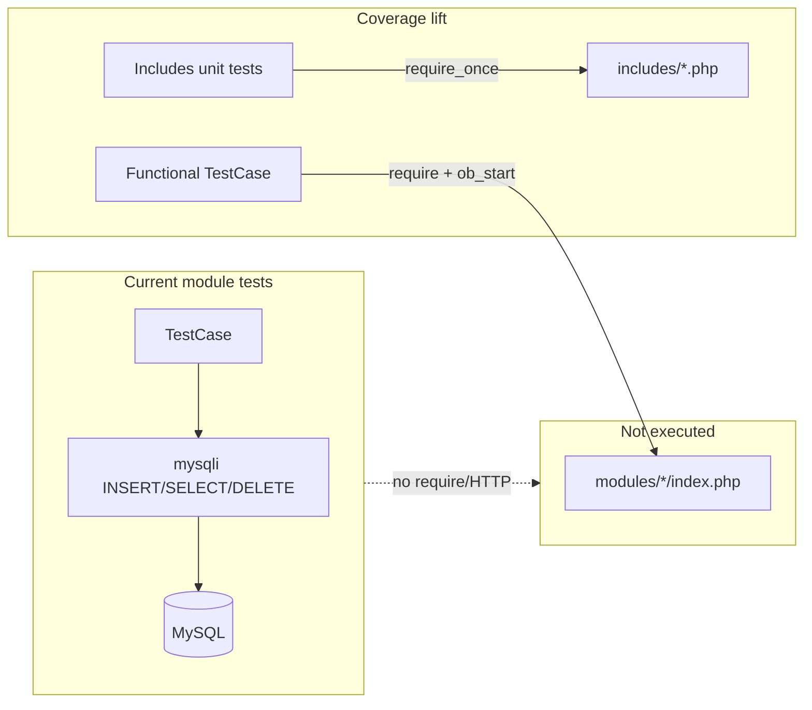

# PHPUnit coverage expansion plan

Add and upgrade PHPUnit tests so HTML coverage executes more production PHP (especially `includes/` helpers and audit `scripts/`), while documenting that headline total % stays low until module entry files are exercised.

**Default deliverable:** Phase 1 (`includes/` + `scripts/`). **Follow-up:** Phase 2 adds module functional pilots via the existing `runIsolated()` pattern.

**Related docs:** [`scripts/SCRIPTS.md`](../scripts/SCRIPTS.md) (PHPUnit runner, interpreting coverage), [`phpunit/tests/PREFERENCES.md`](../phpunit/tests/PREFERENCES.md), [`phpunit/tests/AGENT_NOTES.md`](../phpunit/tests/AGENT_NOTES.md).

---

## Implementation checklist

| ID | Task | Status |
|----|------|--------|
| includes-suite | Add `phpunit/tests/Unit/Includes/` with visibility, MBQA, guard, and switch-port helper tests + `AGENT_NOTES.md` | Pending |
| upgrade-script-stubs | Upgrade 5 audit script `*.unittest.php` stubs to CLI subprocess behaviour tests (`SecurityFixesTest` pattern) | Pending |
| extend-config-scriptlogic | Extend `Configunittest.php` and `ScriptLogic` / `lib_utf8_file` tests with behaviour assertions | Pending |
| verify-coverage | Run `php -l`, `run_tests.php` (with/without DB), `--coverage`; confirm `coverage.html` and area index deltas | Pending |
| docs-pr | Update phpunit `AGENT_NOTES` + `PREFERENCES`; fresh branch, pre-push diff, `gh pr create` | Pending |

---

## Current baseline (from coverage HTML)

| Area | Lines covered | Notes |
|------|---------------|--------|
| **Total** | 469 / 182,402 (**0.26%**) | [`phpunit/coverage/html/coverage.html`](../phpunit/coverage/html/coverage.html) |
| **config** | 89 / 1,245 (**7.15%**) | Bootstrap loads [`config/config.php`](../config/config.php) in most tests |
| **includes** | 24 / 5,930 (**0.40%**) | Only [`includes/bootstrap_helpers.php`](../includes/bootstrap_helpers.php) partially hit (~9%) |
| **modules** | 0 / 157,781 (**0%**) | ~92 `*Test.php` files use MySQLi CRUD only — they never load `modules/*/*.php` |
| **scripts** | 356 / 17,446 (**2.04%**) | [`scripts/api.php`](../scripts/api.php) ~98%; many `*.unittest.php` are **file-exists stubs** |

This matches documented expectations in [`scripts/SCRIPTS.md`](../scripts/SCRIPTS.md) (Interpreting HTML coverage percentages) and [`phpunit/tests/PREFERENCES.md`](../phpunit/tests/PREFERENCES.md).



---

## Root cause to fix (not just add more CRUD tests)

- [`scripts/generate_tests.php`](../scripts/generate_tests.php) scaffolds DB CRUD tests — valuable for regression, **zero impact** on `modules/` HTML coverage.
- Many script tests (e.g. [`check_csrf_coverage.unittest.php`](../phpunit/tests/Unit/Scripts/check_csrf_coverage.unittest.php)) only `assertFileExists` — they register a test but execute **no script lines**.
- Some includes are required in DB tests ([`AlertsTest.php`](../phpunit/tests/Unit/Modules/Alerts/AlertsTest.php)) but coverage HTML may show 0% when the last run used `ITM_SKIP_DB_TESTS=1` (tests skipped). New **DB-free** unit tests for pure helpers guarantee coverage without MySQL.

---

## Recommended scope — Phase 1 (first PR)

Focus on high-value, low-risk coverage lift in `includes/` and `scripts/` without touching Protection Zone modules.

### 1. New `phpunit/tests/Unit/Includes/` suite

Create folder + [`phpunit/tests/Unit/Includes/AGENT_NOTES.md`](../phpunit/tests/Unit/Includes/AGENT_NOTES.md) (from [`templates/AGENT_NOTES.md`](../templates/AGENT_NOTES.md)).

| New test class | Source file | Strategy |
|----------------|-------------|----------|
| `AlertsVisibilityTest.php` | [`includes/alerts_visibility.php`](../includes/alerts_visibility.php) | Pure assertions on `itm_alerts_normalize_sql_alias`, `itm_alerts_visibility_sql`, `itm_alerts_visibility_sql_literal`, `itm_alerts_append_visibility_filter` (no DB) |
| `TodoVisibilityTest.php` | [`includes/todo_visibility.php`](../includes/todo_visibility.php) | Same pattern for todo helpers |
| `NotesVisibilityTest.php` | [`includes/notes_visibility.php`](../includes/notes_visibility.php) | SQL fragment + alias normalization |
| `ItmMbqaTestUserTest.php` | [`includes/itm_mbqa_test_user.php`](../includes/itm_mbqa_test_user.php) | Tag builder + strict detector; negative cases for loose `mbqa-*` prefixes |
| `ItmScriptEntryGuardTest.php` | [`includes/itm_script_entry_guard.php`](../includes/itm_script_entry_guard.php) | Assert guards return true under CLI / bare include; document expected behaviour |
| `SwitchPortApiHelpersTest.php` | [`includes/switch_port_api_helpers.php`](../includes/switch_port_api_helpers.php) | DB-backed tests (skip without `$conn`): `find_lookup_id`, `fetch_company_vlans` with company 1 seed data |

**Pattern** (mirror [`SqlInjectionDetectorTest.php`](../phpunit/tests/Unit/Scripts/SqlInjectionDetectorTest.php)):

```php
protected function setUp(): void {
    if (!defined('ITM_CLI_SCRIPT')) define('ITM_CLI_SCRIPT', true);
    require_once ROOT_PATH . 'includes/alerts_visibility.php';
}
public function testVisibilitySqlWithAlias(): void {
    $sql = itm_alerts_visibility_sql('e');
    $this->assertStringContainsString('e.assigned_to_user_id IS NULL', $sql);
}
```

Rules from [`phpunit/tests/AGENT_NOTES.md`](../phpunit/tests/AGENT_NOTES.md): proper `TestCase`, no top-level `echo`, no bare `require` of scripts with `exit()`.

### 2. Upgrade stub `scripts/` tests to behaviour tests

Replace **file-exists-only** stubs with tests that **execute script logic** (reuse [`SecurityFixesTest::runPhpScriptFile()`](../phpunit/tests/Unit/Security/SecurityFixesTest.php) pattern — `2>&1`, Windows-safe).

**Priority upgrades** (audit scripts referenced in AGENTS.md pre-merge pass):

| Stub today | Upgrade |
|------------|---------|
| [`check_sql_injection_coverage.unittest.php`](../phpunit/tests/Unit/Scripts/check_sql_injection_coverage.unittest.php) | CLI subprocess; assert exit 0 and output contains scan summary |
| [`check_csrf_coverage.unittest.php`](../phpunit/tests/Unit/Scripts/check_csrf_coverage.unittest.php) | Same |
| [`check_audit_logs_coverage.unittest.php`](../phpunit/tests/Unit/Scripts/check_audit_logs_coverage.unittest.php) | Same |
| [`check_display_field_columns_search.unittest.php`](../phpunit/tests/Unit/Scripts/check_display_field_columns_search.unittest.php) | Same (exit 0 on clean tree) |
| [`check_ui_configuration_coverage.unittest.php`](../phpunit/tests/Unit/Scripts/check_ui_configuration_coverage.unittest.php) | Same |

**Optional consolidation:** extract shared `runPhpScriptFile()` into a small trait or base class under `phpunit/tests/Unit/Scripts/` to avoid duplicating `SecurityFixesTest` logic — only if it stays minimal (no new Composer deps).

**Extend existing real tests** (already load libs):

- [`ScriptLogic.unittest.php`](../phpunit/tests/Unit/Scripts/ScriptLogic.unittest.php) — add assertion calls on `itm_write_utf8_text_file` / round-trip temp file (exercises lines, not just `function_exists`).
- [`lib_utf8_file.unittest.php`](../phpunit/tests/Unit/Scripts/lib_utf8_file.unittest.php) — merge into ScriptLogic or add behaviour tests; remove redundant file-exists-only body.

Do **not** bulk-convert all ~80 stub files in one PR — pick audit/security scripts first for reviewability.

### 3. Extend [`Configunittest.php`](../phpunit/tests/Unit/Config/Configunittest.php)

Add tests for additional pure helpers already in bootstrap path (e.g. `cr_humanize_field` if exposed, `itm_resolve_records_per_page` with mocked `$ui_config`) — only functions callable without full HTTP session.

---

## Phase 2 — follow-up PR(s) (module functional coverage)

Use existing patterns — do **not** invent a new framework:

| Pattern | Example | Use for |
|---------|---------|---------|
| AJAX include + `ob_start` | [`PasswordsFunctionalTest.php`](../phpunit/tests/Unit/Modules/Passwords/PasswordsFunctionalTest.php) | Module `ajax_handler.php` |
| Isolated subprocess include | [`SecurityFixesTest::runIsolated()`](../phpunit/tests/Unit/Security/SecurityFixesTest.php) | `modules/*/index.php` auth/redirect guards |

**Pilot modules** (small, non–Protection Zone, high business value):

1. **`vlans`** — simple CRUD module; assert list HTML contains module title when session valid.
2. **`departments`** — bulk toolbar markers; complements MBQA.
3. **`alerts`** — tie functional load to visibility helpers already tested in Phase 1.

Each pilot: one `*FunctionalTest.php` under `phpunit/tests/Unit/Modules/<slug>/`, skip without DB, clean up inserted rows in `tearDown`.

**Expected impact:** `modules/` moves from 0% to a small non-zero %; **Total** still &lt;1% until many modules are covered — document in PR body, do not chase headline %.

---

## Out of scope (unless explicitly requested)

- Changing [`phpunit/phpunit.xml`](../phpunit/phpunit.xml) `<coverage><include>` (narrowing improves focused % but hides regressions elsewhere).
- Regenerating all module CRUD tests via `generate_tests.php`.
- Protection Zone modules ([`AGENTS.md`](../AGENTS.md) §3).
- MBQA runner as PHPUnit replacement (keep separate per SCRIPTS.md).

---

## Verification (mandatory before PR)

From repository root:

```bash
php -l phpunit/tests/Unit/Includes/*.php   # new files
php -l phpunit/tests/Unit/Scripts/*.php    # touched stubs
php scripts/run_tests.php                  # full suite with MySQL
php scripts/run_tests.php --coverage       # Xdebug/PCOV; confirm coverage.html
ITM_SKIP_DB_TESTS=1 php scripts/run_tests.php --coverage  # DB-free helpers still pass
```

Confirm:

- No Warning/Fatal during “Generating code coverage report”.
- [`phpunit/coverage/html/includes/index.html`](../phpunit/coverage/html/includes/index.html) shows green on visibility/MBQA/guard files.
- [`phpunit/coverage/html/scripts/index.html`](../phpunit/coverage/html/scripts/index.html) shows increased % on upgraded audit scripts.

---

## Documentation updates (implementation PR)

| File | Update |
|------|--------|
| [`phpunit/tests/Unit/Includes/AGENT_NOTES.md`](../phpunit/tests/Unit/Includes/AGENT_NOTES.md) | New — maps tests to `includes/` helpers |
| [`phpunit/tests/AGENT_NOTES.md`](../phpunit/tests/AGENT_NOTES.md) | Add `Unit/Includes/` to file structure |
| [`phpunit/AGENT_NOTES.md`](../phpunit/AGENT_NOTES.md) | Mention Includes test suite |
| [`phpunit/tests/PREFERENCES.md`](../phpunit/tests/PREFERENCES.md) | Note Phase 1 vs Phase 2 coverage strategy (optional short paragraph) |

No change to [`scripts/SCRIPTS.md`](../scripts/SCRIPTS.md) unless runner behaviour changes.

---

## Git / PR workflow

Per [`AGENTS.md`](../AGENTS.md):

1. `git fetch origin master && git checkout master && git pull`
2. Branch: `cursor/phpunit-includes-scripts-coverage-d148` (or a docs-only branch when saving this plan)
3. Pre-push: `git diff origin/master...HEAD` (full read)
4. One `git push -u origin <branch>` + `gh pr create --body-file .pr-body-tmp.md`
5. PR lists exact commands run and notes **headline % expectation** (~0.26% → modest bump, not 80%)

---

## Success criteria

- New Includes tests pass with and without MySQL (where designed).
- At least 5 audit script stubs upgraded from file-exists to CLI behaviour.
- HTML coverage regenerates cleanly.
- `includes/` bucket measurably above 0.40% lines; audit scripts show executed lines in HTML report.
- AGENT_NOTES updated for touched folders.
