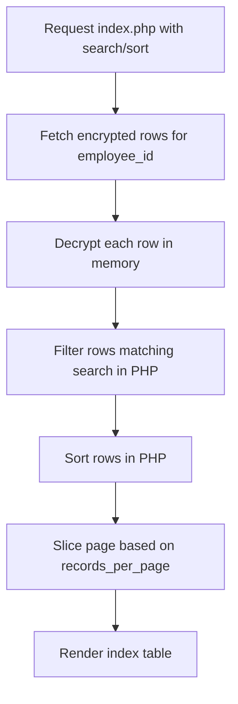

# Private Contacts Module & Vault PII Security

Comprehensive technical documentation for the user-scoped secure address book, AES-256 PII encryption-at-rest, memory-based search, sorting, pagination models, and secure temporary sharing integrations.

---

## 1. Intent & Purpose

The **Private Contacts** module (`modules/private_contacts/`) provides employees with a secure, personal address book. Because this module handles sensitive personally identifiable information (PII)—including personal emails, mobile numbers, and home addresses—it is built on a zero-knowledge architecture. Private records are stored encrypted at rest, isolated from other users under the active company, and decrypted only in-memory when the individual user unlocks their cryptographic vault.

---

## 2. Privacy Scoping & Isolation

- **Owner Scoping:** All queries strictly filter on both `company_id` and the current user's session ID (`employee_id = $_SESSION['employee_id']`). 
- **Isolation:** Users can never view, search, edit, or delete another employee's private contacts. No global admin bypass is defined for reading contact ciphertext—it remains strictly isolated.

---

## 3. Cryptographic Guardrails (AES-256-CBC)

Personal fields on the `private_contacts` table are stored in the database as base64-encoded encrypted strings:

### A. Vault Encryption at Rest
- **Helper:** `itm_encrypt($plaintext, $_SESSION['vault_key'])`
- **Session Key:** Decryption requires the vault session key (`hash('sha256', $plaintext_master_key)`), which is only available while the user's vault is unlocked.
- **Legacy Fallback:** Plaintext records written prior to the cryptographic rollout are recognized and supported via `pc_private_text_legacy_plaintext_check()`.

### B. Memory-Based Search, Sorting, and Pagination
Because the columns are stored encrypted, the database cannot perform traditional indexing or query operations like `LIKE '%search%'` or `ORDER BY contact_name` on ciphertext. To preserve search capability:
1. The system loads **all** encrypted contact rows for the signed-in user into PHP memory.
2. The rows are decrypted on-the-fly using the active vault key.
3. Filtering is performed in PHP memory using the helper `pc_row_matches_search()`.
4. Sorting is handled in-memory using PHP array functions (`pc_compare_contact_rows()`).
5. Pagination is sliced after filtering and sorting, ensuring only the current page offset is rendered to the UI.



### C. Master Key Rotation
When an employee changes their vault master key, all private contacts are re-encrypted. The change handler inside `user-config.php` executes a database transaction and calls `itm_vault_reencrypt_private_contacts()` to decrypt all contacts using the old key and re-encrypt them with the new key atomically.

---

## 4. UI Layout & Vault State Gates

- **Vault Locked Screen:** If the vault session key is missing, any attempt to access the Private Contacts module displays the vault lock gate (`pc_vault_bootstrap.php`).
- **Two-Factor Lock:** If 2FA is active, unlocking the contact log requires both the master key and a valid 6-digit TOTP code (`includes/itm_vault_unlock.php`).
- **Index List Layout:** The list table supports standard settings buttons (Select to Delete, Clear Table), pagination via emoji-only pagination anchors (⏮️ / ◀️ / ▶️ / ⏭️), and column sorting controls.

---

## 5. Temporary QR & Secure Sharing

Users can share individual private contacts securely with others:
1. **Creation:** Clicking the **Share 📱** icon from the index list triggers an AJAX request to `api.php?create_share_session=1`, verifying the vault is active.
2. **Session Storage:** Plaintext contact fields are copied into the `share_sessions` table (`module_slug = private_contacts`) with a temporary expiration TTL.
3. **Distribution:** Generates a secure QR code and copyable Outlook/WhatsApp links.
4. **Access Gate:** Verification checks company sharing permissions via `has_module_share_access()`.
5. **PII Isolation:** The `share_sessions` table is **exempt** from standard database audit triggers, keeping temporary sharing metadata completely private.

---

## 6. Import & Export Integration

### Custom Tool Constraints
- **Default Toolbar Disabled:** To prevent the silent exfiltration of unencrypted CSVs, default table exports are disabled on the list card via `data-itm-no-export-excel` and `data-itm-no-export-pdf`.
- **Decrypted Exports:** Users can only export contacts in decrypted form through the dedicated secure Tools modal (which requires a confirmed session and vault unlock).
- **Excel Imports:** File imports mapped via `data-itm-db-import-endpoint="index.php"` parse rows, normalize values, and automatically encrypt the fields using `pc_encrypt_contact_import_row_values()` before persisting to the database.

---

## 7. Verifications & Diagnostics

Run the following regression tools from the repository root to verify Private Contacts privacy, search, encryption, and temporary share integrity:

```bash
# Verify contact vault unlocking, decryption, sorting, and master key rotations
php scripts/verify_private_contacts_vault.php

# Test secure QR sharing sessions and company-level share access gates
php scripts/verify_qr_share_modules.php
```
