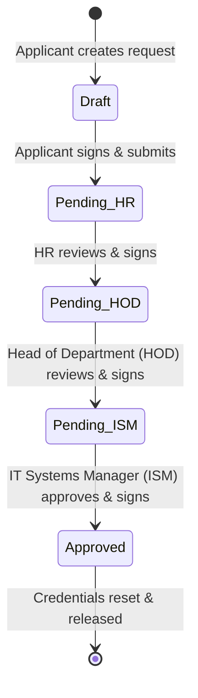

# Request Password Reset & Signatures Workflow

Technical documentation for the multi-stage password reset request system (`modules/request_password/`), human-approver authorization chain, visual signatures state, automated email routing, and creator-only soft-delete restrictions.

---

## 1. Intent & Purpose

The **Request Password** module provides a secure, structured workflow for resetting employee system and workstation credentials. To protect corporate systems from social engineering and unauthorized account takeovers, the module implements a strict multi-stage approval sequence. A request is not completed until multiple independent corporate entities authorize and sign the record.

---

## 2. Multi-Stage Approval Chain & Roles

The authorization pipeline requires successive validation from three distinct corporate roles before the IT Systems Manager (ISM) can release the new credentials:



### Required Approvers

| Step | Approving Role | Responsibility |
|---|---|---|
| **1** | **Applicant** | Initiates the request, providing full name, employee ID, and details. |
| **2** | **Human Resources (HR)** | Verifies the applicant's active employment status and identity. |
| **3** | **Head of Department (HOD)** | Authorizes the request based on department operational needs. |
| **4** | **IT Systems Manager (ISM)** | Validates all prior signatures, executes the credential reset, and signs the release. |

---

## 3. Visual Signature Blocks

Every request card renders four distinct signature boxes. Each block displays:
- The approver's full name (combining `first_name` and `last_name`, with `username` as a fallback).
- The exact approval timestamp (`dd/mmm/yyyy - H:i:s`).
- A status badge (e.g. `Signed` or `Pending`).

- **Verification:** Signature dates and names are read-only once saved. Form handlers verify that the active session user matching the required approver role is the one executing the signature action.

---

## 4. Automated Transactional Email Notifications

The module orchestrates notifications dynamically as the request changes state, utilizing the core `itm_send_email()` transport helper:

1. **Initial Submit:** The system scans for active HOD and HR managers assigned to the applicant's department and dispatches transactional emails requesting review.
2. **Successive Approvals:** When HR signs, an alert is sent to the HOD. When HOD signs, an alert routes to the ISM queue.
3. **Completion Release:** Once the ISM signs and completes the reset, automated emails notify the Applicant and the ISM. 
- **Security Constraint:** For security compliance, notification bodies contain **no** password plaintext or temporary reset links. They only contain a link to view the request status inside the secure ITM dashboard.

---

## 5. Creator-Only Soft-Delete Restrictions

To preserve the audit trail and prevent unauthorized deletion of pending requests, the module enforces strict creator-only rules:

- **Delete Gate:** Only the individual employee who created the request (`created_by = $_SESSION['employee_id']`) may delete it.
- **Unauthorized Deletion Blocks:**
  - If a non-owner clicks the Delete button in the UI, they receive an immediate browser warning.
  - If a user attempts to bypass the UI by submitting a crafted HTTP POST request, the server-side delete handler validates the owner ID and rejects the request with a warning flash message.
- **Soft-Delete Only:** Hard deletes are blocked. Deleting a request updates its status, setting `active = 0`, `deleted_by = session_user`, and `deleted_at = NOW()`.

---

## 6. Verifications & Operational Diagnostics

Run the following diagnostics from the repository root to verify approval states, signature validation gates, automated notifications, and owner-only delete restrictions:

```bash
# Verify Request Password multi-stage approval gates, signatures, and notifications
php scripts/verify_request_password.php

# Audit delete bypass attempts and security boundary rules
php scripts/repro_request_password_bypass.php
```
