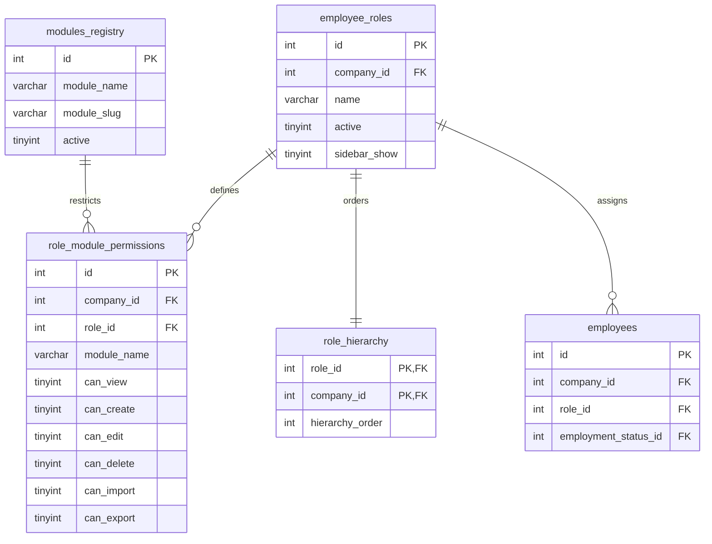

# Roles & Permissions Management (RBAC Matrix)

Unified dashboard for tenant-level role management and the Role-Based Access Control (RBAC) permission matrix. It replaces the legacy practice of editing database permission rows manually, offering a secure dual-pane interface.

---

## 1. Intent & Purpose

The **Roles & Permissions** module (`modules/roles_permissions/`) enables administrators to define custom organization roles and configure fine-grained permissions per module. It separates company-level module availability (managed via **Company Module Access**) from individual user capability gates within the active tenant.

---

## 2. Architectural Map & Database Schema

The module coordinates several tables to manage roles, hierarchy, and permissions dynamically:



### Table Schema Highlights

| Table | Column | Type / Constraints | Role |
|---|---|---|---|
| **`employee_roles`** | `sidebar_show` | `TINYINT(1) NOT NULL DEFAULT 1` | Overrides personalized user sidebar preferences to keep required modules visible. |
| **`role_hierarchy`** | `hierarchy_order` | `INT NOT NULL DEFAULT 999` | Defines the display sort order in the Roles sidebar. |
| **`role_module_permissions`** | `module_name` | `VARCHAR(100)` | Matches the `modules_registry.module_name` or standard `ALL` wildcard. |
| | `can_view`, `can_create`, `can_edit`, `can_delete`, `can_import`, `can_export` | `TINYINT(1) DEFAULT 0` | The six standard RBAC permission flags. |

---

## 3. Business Rules & Access Controls

### A. Non-Admin vs. Admin Access
- **Browse (Read-Only):** All signed-in tenant employees can access the Roles & Permissions dashboard to browse existing roles and inspect the active permission matrix.
- **Manage (Write):** Only global/tenant administrators (resolved via `itm_is_admin($conn)`) can create roles, rename roles, toggle sidebar visibility, or save changes to the permission matrix. Non-admin modification attempts return HTTP 403.

### B. Special Admin Role Wildcard
- The seeded role named **Admin** (case-insensitive name match) is reserved.
- It is assigned the `ALL` wildcard row in `role_module_permissions`.
- To prevent accidental lockout, the Admin role's matrix checkboxes are locked as read-only and always render as checked. Rename and edit operations on the Admin role are blocked.

### C. Sidebar Active Employee Counts
- The sidebar list of roles displays an active employee count next to each role card (e.g. `5 active`).
- **Calculation:** This count strictly counts employees assigned to that role who have an HR employment status of **Active** (via `itm_employee_active_employment_status_join_sql()`).
- It does **not** reflect online user session presence ("Online now") or total assigned employees who might be inactive or on leave.

### D. Permission Inheritance & Wildcards
- When resolving a user's permission for a module, the system checks `role_module_permissions` for a specific match.
- **Fallback Hierarchy:**
  1. Specific module row in `role_module_permissions` (e.g. `equipment`).
  2. Wildcard row where `module_name = 'ALL'`.
  3. All flags default to `0` (false) if neither is configured.

---

## 4. UI Layout & User Experience

The module features a responsive dual-pane layout modeled after the system settings:

1. **Left Sidebar (Roles List):**
   - Lists active roles sorted by `hierarchy_order` ASC, then `name` ASC.
   - Shows role names, active employee counts, and metadata badges (e.g., `System` for Admin or `Sidebar hidden` when `sidebar_show = 0`).
2. **Right Pane (Permission Matrix):**
   - Displays the active role name, custom metadata, and a standard settings toolbar (Check All, Uncheck All, Save `💾`).
   - Standard scrollable table listing all registered modules from `modules_registry`.
   - Center-aligned checkboxes for the six RBAC flags.
   - Subsystem links on module names for quick navigation.

---

## 5. API Actions

The dashboard interacts with the backend through standardized AJAX handlers inside `index.php`. All mutations require valid CSRF tokens (`itm_require_post_csrf()`) and administrator access:

### `ajax_action=save_permissions`
- **Method:** POST
- **Payload:** `permissions_json` (serialized array of module permission rows for the selected role).
- **Behavior:** Performs an upsert on `role_module_permissions` for the target role. The `ALL` wildcard row is protected from modification.

### `ajax_action=create_role`
- **Method:** POST
- **Payload:** `name` (string), `sidebar_show` (boolean).
- **Behavior:** Inserts a new role into `employee_roles` and registers a corresponding sequence row in `role_hierarchy` at the end of the order.

### `ajax_action=update_role`
- **Method:** POST
- **Payload:** `id` (int), `name` (string), `sidebar_show` (boolean).
- **Behavior:** Updates role details for non-Admin roles.

---

## 6. Code Integration Examples

### A. Verifying a Permission in PHP

Always check the user's role permissions using the core helper functions in `includes/itm_role_module_permissions.php`:

```php
require_once '../../config/config.php';
require_once ROOT_PATH . 'includes/itm_role_module_permissions.php';

$companyId = itm_resolve_active_company_id();
$employeeId = (int)($_SESSION['employee_id'] ?? 0);
$moduleName = 'equipment';

// Perform the RBAC check for the View permission
if (!itm_role_has_module_permission($conn, $companyId, $employeeId, $moduleName, 'view')) {
    http_response_code(403);
    echo "Access Denied: You do not have permission to view this module.";
    exit;
}
```

### B. Dynamic Role Exemption Lookups
The module itself is exempted from classic table RBAC checks using the exemption helper:

```php
// Part of includes/itm_role_module_permissions.php
function itm_crud_rbac_exempt_module_slugs(): array {
    return [
        'roles_permissions',
        'settings',
        'dashboard',
        // other exempt modules...
    ];
}
```

---

## 7. Operational Troubleshooting & Verification

### Common Pitfalls
- **Seeding Mismatch:** When writing database migrations, avoid hardcoding numeric `role_id` or `permission_id` values. Always use tenant-scoped name subqueries to resolve roles correctly.
- **Wildcard Lockouts:** Ensure `ALL` wildcard rows are never overwritten via standard matrix saves, as they govern Admin system access.

### Manual Verification
To verify the Roles & Permissions matrix integrity and test multi-tenant RBAC rules, execute the CLI regression runner from the repository root:

```bash
php scripts/verify_roles_permissions.php
```

To capture a fresh screenshot of the matrix for the README assets, run the Playwright headless capture tool:

```bash
ITM_SCREENSHOT_ONLY=roles_permissions python3 scripts/take_screenshots_modules.py
```
