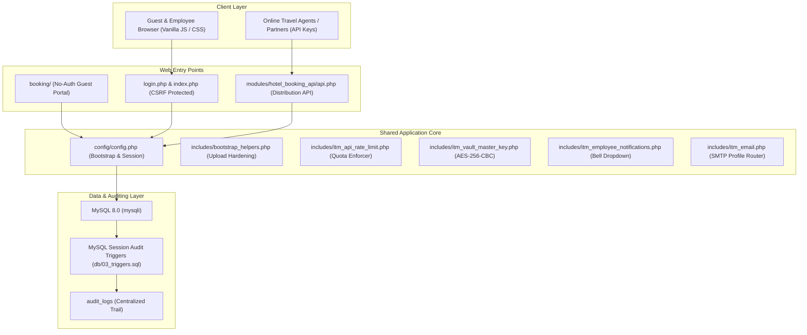

# Project Handoff: IT Management System (ITM)

This document serves as a complete, professional, and comprehensive handoff guide for the **IT Management System (ITM)**. It transfers ownership of the project to the incoming development agency, providing deep technical details, architectural maps, operational procedures, known risks, and strategic next steps.

---

## 1. Overview

### 1.1 What the IT-Management Project Is
The **IT Management System (ITM)** is an enterprise-grade Operations, Asset, Productivity, and Hospitality Management Platform designed for multi-company (SaaS) environments. Built with a lightweight, flat procedural architecture, the system is fully self-contained and operates with **zero external dependencies** (no Composer, no NPM, no vendor-directory baggage). This zero-dependency model keeps the code resilient, extremely fast, and completely free from third-party supply-chain CVE vulnerabilities.

### 1.2 Core Purpose and Value
The system serves as a unified digital workspace for small to medium-sized enterprises (SMEs) and hospitality properties. Its value lies in:
*   **Multi-Tenant Isolation:** Standardizing business and system assets across up to 5 distinct seeded companies, strictly scoped by `company_id`.
*   **Asset & Network Infrastructure Auditing:** Consolidating workstations, servers, network printers, rack elevations, IDF port mappings, and IPAM subnets under one relational database.
*   **Operational & Financial Control:** Organizing helpdesk ticketing, employee onboarding workflows, annual/monthly budgeting, accounts payable (bills), accounts receivable (invoices), and daily hotel operational reporting.
*   **Secure Personal Productivity:** Providing employee-scoped secure password vaults, private contacts, labeled notes, and bookmarks—all encrypted at rest using high-entropy master keys.
*   **Direct-to-Guest Hospitality:** A public guest booking portal alongside a robust multi-channel XML/JSON Booking Distribution API for partners and OTAs.

### 1.3 High-Level Architecture Summary
The application follows a procedural PHP design pattern combined with custom layouts, styled with a modern GitHub Copilot-inspired dark/light theme.



---

## 2. Current Status

### 2.1 Completed Features
The repository is highly mature, with fully implemented, production-ready modules across the following areas:
*   **System Core & RBAC:** Complete multi-company tenant switching, dynamic UI layouts, customizable sidebar preferences, and a 6-column RBAC permission matrix (View, Add, Edit, Delete, Import, Export).
*   **IT Infrastructure:** Drag-and-drop physical rack planners, visual high-density IDF port guides, IPAM subnets (with TCP connect discovery probes), and workstation/printer tracking.
*   **Productivity Suites:** Folder-tree bookmark managers with drag-and-drop reordering, labeled personal notes, to-do lists, and user-scoped private contacts.
*   **Workflow & Approvals:** HR/HOD/ISM multi-stage approval workflow for password resets, daily hotel operations reporting (Ops Report), and backup tape log grids.
*   **Direct-to-Guest Hospitality:** Multi-step guest room booking workflow at `booking/` with dynamic pricing breakdown, stay-date check range, and auto-generated HTML-to-PDF confirmation invoices.
*   **Hotel Booking Distribution:** Unified XML/JSON API for third-party channels (compliant with OpenTravel XML specifications, Booking.com Connectivity, and Oracle OHIP formats) with secure outbound webhook retry queues.

### 2.2 In-Progress Work & PHP 8+ Compatibility Checks
A primary technical objective is verifying and adjusting the codebase to support **PHP 8.0, 8.1, and 8.2**. While the code runs perfectly on **PHP 7.4.33**, the transition to PHP 8+ is critical for modernization. The status of this compatibility check is as follows:
*   **Strict Types & Deprecations:** Several legacy string-to-number coercions, non-standard date handling, and variable declarations need auditing to prevent fatal PHP 8 errors.
*   **MySQLi Variable Binding:** PHP 8+ strictly enforces argument counts on prepared statement bindings. Verification scripts have been successfully added to enforce `mysqli_stmt_bind_param` contracts.
*   **Curly Braces for Offsets:** The codebase has been audited to replace deprecated curly brace string offsets (e.g. `$str{0}`) with square brackets (e.g. `$str[0]`).
*   **`NO_ZERO_DATE` Restrictions:** weekly resignation reports and dates cannot use the literal `'0000-00-00'` under strict MySQL 8 mode. The custom `itm_sql_valid_date_predicate()` helper is deployed to normalize date queries.

### 2.3 Blockers or Pending Decisions
*   **Autoloading vs. procedural inclusion:** The project heavily relies on procedural file inclusion (`require_once`). While this achieves zero-dependency simplicity, a migration to standard PSR-4 autoloading (even a custom lightweight version) would resolve file path dependency issues.
*   **Online Payment Gateway:** The public booking portal operates entirely on a **Payment-at-Hotel** model. A strategic decision must be made whether to integrate a standard checkout gateway (Stripe/PayPal), which would require introducing secure API credentials and webhooks.

### 2.4 Known Limitations
*   **No Composer/NPM dependency managers:** While highly secure against supply-chain attacks, this requires developers to write custom procedural implementations for complex requirements (e.g., parsing XML, rendering calendar grids, and generating PDFs).
*   **Zero-Knowledge Key Lockout:** There is no "Forgot Master Key" link for the security vault. Because the plaintext key is never stored, an employee who loses their master key is permanently locked out of their private data. Recovering requires a complete database purge of their encrypted rows.

---

## 3. Feature Breakdown

The application is composed of **13 central functional domains**, with **221** module folders (`modules/*/index.php`) and **224** database tables (`db/01_schema.sql`).

```
┌────────────────────────────────────────────────────────────────────────────────────────┐
│                                 13 Functional Domains                                  │
├───────────────────────────────┬────────────────────────────────┬───────────────────────┤
│ 1. Core & RBAC                │ 5. Networking & Cabling        │ 9. Hospitality Core   │
│ 2. HR & Employee Lifecycle    │ 6. Floor Plans & Site Maps     │ 10. Distribution API  │
│ 3. Finance & Budgeting        │ 7. Productivity (Vault)        │ 11. Support & Chatbot │
│ 4. Asset & Inventory          │ 8. Collaboration & Calendars   │ 12. Document & Ops Log│
│                               │                                │ 13. System Monitoring │
└───────────────────────────────┴────────────────────────────────┴───────────────────────┘
```

### 3.1 Domain Breakdown & Important Logic Files

#### 3.1.1 Core System & RBAC (Role-Based Access Control)
*   **Tables:** `companies`, `employees`, `employee_companies`, `employee_roles`, `role_hierarchy`, `role_module_permissions`, `modules_registry`, `company_module_access`
*   **Core Purpose:** Identity verification, multi-tenant isolation, company session switching, and module-level permission enforcement.
*   **Key Logic Files:**
    *   `config/config.php`: Central application bootstrap, session validation, and tenant initialization.
    *   `includes/itm_company_module_access.php`: `has_module_access()` handles the per-tenant opt-out matrix (denies access only when explicit `enabled = 0` exists).
    *   `includes/itm_role_module_permissions.php`: Implements `itm_require_crud_role_module_permission()` which gates index list actions based on RBAC matrix columns (View, Add, Edit, Delete, Import, Export).

#### 3.1.2 HR & Employee Lifecycle
*   **Tables:** `employees`, `employee_positions`, `employee_statuses`, `employee_assignment_history`, `employee_onboarding_requests`, `departments`
*   **Core Purpose:** Track employee career lifecycles, assign reporting lines, manage departments, and process credentials securely.
*   **Key Logic Files:**
    *   `modules/employees/index.php`: Contains the complex CSV/Excel import parser with automated entity resolution (creates missing departments/positions on the fly) and automatic email routing (personal vs work).
    *   `includes/itm_employee_contact_email.php`: Standardizes contact email enforcement (requires at least one valid work or personal email on create/edit/import).

#### 3.1.3 Finance, Budgeting & Accounts Payable (AP) / Accounts Receivable (AR)
*   **Tables:** `annual_budgets`, `monthly_budgets`, `expenses`, `bills`, `bill_line_items`, `invoices`, `invoice_line_items`, `suppliers`, `customers`, `finance_payment_allocations`
*   **Core Purpose:** Scope financial planning, track real-time budgets versus actual expenditures, manage AP/AR ledger invoicing, and automate recurring expenses.
*   **Key Logic Files:**
    *   `includes/itm_finance_payments.php`: Manages payment allocations, automatically updating `amount_due` header totals on bills/invoices.
    *   `modules/bills/` & `modules/invoices/`: Provide UI hooks to post AP/AR document amounts directly into the central `expenses` ledger table (aligning `bill_id` or `invoice_id`).

#### 3.1.4 Asset Management & Procurement
*   **Tables:** `equipment`, `equipment_types`, `equipment_statuses`, `equipment_environment`, `catalogs`, `license_management`, `license_types`, `patches_updates`
*   **Core Purpose:** Track physical equipment (servers, switches, workstations, laptops) with photo uploads, manage software license purchase/expiry, and track security updates.
*   **Key Logic Files:**
    *   `modules/equipment/create.php`: Processes multi-file photo uploads with dynamic thumbnails and drag-and-drop targets.
    *   **Equipment Facades:** Small filtered router directories (`is_server`, `is_switch`, `is_workstation`) that delegate directly to `modules/equipment/` with preloaded type parameters.

#### 3.1.5 Networking, Cabling & IPAM (IP Address Management)
*   **Tables:** `racks`, `rack_planner`, `idfs`, `idf_ports`, `idf_positions`, `switch_ports`, `vlans`, `ip_subnets`, `ip_addresses`
*   **Core Purpose:** Visualize data center racks, plan elevations via drag-and-drop, map switch ports, organize VLAN boundaries, and scan subnet ranges.
*   **Key Logic Files:**
    *   `modules/rack_planner/index.php`: Houses the HTML5 Drag-and-Drop elevation layout. Auto-syncs pricing edits back to source catalogs and equipment structures.
    *   `includes/get_ports.php` & `includes/update_port.php`: Core JSON backend for the interactive Switch Port Manager. Supports copper vs fiber port ordering, real-time status toggles, and multi-tenant isolation.
    *   `modules/ip_subnets/index.php`: Implements **Network Discovery** via direct non-blocking TCP connect probes (avoiding forbidden shell `exec()` calls).

#### 3.1.6 Floor Plans & Physical Mapping
*   **Tables:** `floor_plans`, `floor_plan_folders`, `floor_plan_tags`, `floor_designer`, `floor_designer_points`
*   **Core Purpose:** Physical asset layout modeling, drawing gallery folders, and interactive spot layouts on uploaded image blueprints.
*   **Key Logic Files:**
    *   `modules/floor_plans/index.php`: Dynamic sidebar gallery that lists drawings (JPG, PNG, PDF, AutoCAD formats), tags files, and supports dragging items into nested directories.
    *   `modules/floor_designer/`: Implements SVG coordinate mapping to pinpoint exact physical locations of workstations, servers, or access points on blueprints.

#### 3.1.7 Productivity & Security Vault
*   **Tables:** `password_entries`, `password_folders`, `notes`, `note_labels`, `bookmarks`, `bookmark_folders`, `todo`, `todo_categories`
*   **Core Purpose:** Encrypted storage of system credentials, shared developer notes, and bookmark folders scoped strictly per employee.
*   **Key Logic Files:**
    *   `includes/itm_vault_unlock.php`: Standard lock interface requiring the user's master key and 6-digit TOTP code when two-factor authentication is active.
    *   `includes/itm_vault_master_key.php`: Implements transactional, multi-table encryption rotation. Reads, decrypts, and re-encrypts all database records when a user changes their vault master key.

#### 3.1.8 Collaboration & Calendars
*   **Tables:** `events`, `event_categories`, `alerts`, `appointment_settings`, `appointments`
*   **Core Purpose:** Centralize corporate event timelines, schedule server-room maintenance alerts, and provide self-service IT support appointment calendars.
*   **Key Logic Files:**
    *   `modules/calendar/index.php`: Consolidates multi-source events, alerts, workstation warranty expirations, and helpdesk ticket deadlines into a Monday-to-Sunday UI.
    *   `modules/appointments/api.php`: Handles slot generation, business hours lookup, and double-booking prevention utilizing the `booking_lock` unique index.

#### 3.1.9 Hospitality & Guest Booking Portal
*   **Tables:** `hotel_booking_hotels`, `hotel_booking_rooms`, `booking_rooms_types`, `hotel_bookings`, `customers`
*   **Core Purpose:** No-auth public lodging reservation dashboard, multi-step room selections, stay pricing calculations, and post-booking invoice generation.
*   **Key Logic Files:**
    *   `booking/bootstrap.php`: Initializer that bypasses standard employee login gates when loading public assets.
    *   `includes/itm_hotel_booking.php`: Contains the central pricing calculator (`itm_hotel_booking_portal_hotel_pricing()`) which rollups guest nightly tariffs, tax rates, breakfast supplements, and member discounts.

#### 3.1.10 OTA & Partner Distribution Channel
*   **Tables:** `hotel_booking_distribution_channels`, `hotel_booking_distribution_mappings`, `hotel_booking_distribution_reservations`, `hotel_booking_distribution_webhook_queue`
*   **Core Purpose:** Synchronize reservation feeds with channels like Booking.com and Oracle OHIP, map room type codes, and push Availability, Rate, and Inventory (ARI) updates.
*   **Key Logic Files:**
    *   `modules/hotel_booking_api/api.php`: Dedicated auth-by-API-key router resolving XML/JSON actions.
    *   `includes/itm_hotel_booking_distribution_wire.php`: Dynamic adapter parsing XML requests and building OpenTravel-compliant responses.
    *   `includes/itm_hotel_booking_distribution_webhooks.php`: Operates the outbound queue, calculating signature payloads and executing exponential backoff retries.

#### 3.1.11 Support & Automated Chatbot
*   **Tables:** `tickets`, `ticket_categories`, `ticket_priorities`, `ticket_statuses`, `knowledge_base`
*   **Core Purpose:** IT Helpdesk ticketing and a tenant-scoped intelligent chatbot for immediate employee assistance.
*   **Key Logic Files:**
    *   `modules/knowledge_base/chat_api.php`: Processes context search queries strictly bounded by the active `company_id`.
    *   `js/chatbot.js`: The frontend interface that parses search answers, escapes XSS inputs, and triggers contacts list escalations when the keyword "escalate" is entered.

#### 3.1.12 Operational Logs & Documents
*   **Tables:** `visitors_access_log`, `backup_tape_log`, `ops_report`, `ops_report_fb_outlet`
*   **Core Purpose:** Immutable operational recording (visitor logs, daily backups, hotel performance reports).
*   **Key Logic Files:**
    *   `modules/visitors_access_log/index.php` & `modules/backup_tape_log/`: Lock historical records for editing or deletion once their date has passed, preserving record integrity.
    *   `modules/ops_report/index.php`: Aggregates complex F&B covers, shift updates, and revenue metrics. Features a strict D-2 edit lock for non-administrators.

#### 3.1.13 Real-Time Server Monitoring
*   **Tables:** `system_status` (cache table)
*   **Core Purpose:** Provide real-time server diagnostics (CPU load, RAM consumption, disk storage, database usage, and active extensions).
*   **Key Logic Files:**
    *   `scripts/system_status_api.php`: Direct JSON dispatcher resolving system metrics.
    *   `includes/itm_system_status_native.php`: Platform-independent queries gathering disk space and database engine sizing.
    *   `includes/*.ps1`: PowerShell wrapper scripts queried on Windows/Laragon to parse task list metrics and hardware configurations.

---

## 4. Technical Context

### 4.1 Key Directories
*   `config/`: Core system setup (`config.php` bootstraps database connections, session lifetimes, and encryption salts).
*   `db/`: Database initialization SQL scripts, triggers, and migrations.
*   `includes/`: Shared procedural code blocks (sidebar menus, global headers, database connection utilities, encryption helpers).
*   `modules/`: Feature-specific CRUD screens (index, create, edit, view, delete, list_all).
*   `scripts/`: Automation scripts, system maintenance tasks, QA engines, and security PoC verification files.
*   `booking/`: Public hotel reservation dashboard (dates, rooms, customize, confirmation, manage reservation).
*   `phpunit/`: Unit test suite structure (ran via `scripts/run_tests.php`).

### 4.2 Important Scripts & Backfill Utilities
The system features a highly functional `scripts/` library. The most critical maintenance and backfill utilities are:

| Script | Execution Command | Purpose |
|--------|-------------------|---------|
| **Database Schema Verification** | `php scripts/verify_database_schema.php` | Compares expected tables inside `01_schema.sql` against the live SQL schema. |
| **Incremental Migration Runner** | `php scripts/migrate.php --apply` | Probes live tables for missing migrations under `db/migrations/`, applies them, and logs checksum hashes in `schema_migrations`. |
| **Directory Hardening Backfill** | `php scripts/empty_folders.php` | Iterates through every project folder, writing empty `index.html` placeholders and managed `.htaccess` upload rules. |
| **Files HTAccess Hardening** | `php scripts/ensure_files_htaccess_chain.php` | Restores `deny_http` `.htaccess` rules on every segment of the multi-tenant `files/` storage tree. |
| **UI Action Label Normalizer** | `php scripts/apply_ui_action_emoji.php --apply` | Audits interactive controls and page headings, enforcing standard **emoji-only** visible labels. |
| **UTF-8 Mojibake Repair Tool** | `php scripts/apply_utf8_mojibake_fix.php --apply` | Scans text encodings across source files, converting Windows-1252 anomalies back to clean UTF-8. |
| **Inbound Email → Tickets** | `php scripts/run_inbound_email_tickets.php` | Cron: poll inbound mail (IMAP or local **Mailpit** when `imap_host=mailpit`) from the default SMTP profile + inbound toggle; create tickets or append threaded replies for mail to `companies.email`. Dedupe `ticket_inbound_email_messages`; keyword routing `ticket_inbound_email_routing_rules`; event log in `emails.details`. Production IMAP requires PHP `imap` on the CLI binary. Verify: `php scripts/verify_inbound_email_tickets.php`. |

### 4.3 Dependencies & Sizing
*   **PHP SAPI Requirements:** Runs on **PHP 7.4.33** (with ongoing PHP 8+ modernization). Requires the following extensions enabled in `php.ini`: `mysqli`, `dom`, `json`, `libxml`, `mbstring`, `tokenizer`, `xml`, `xmlwriter`, and **`imap`** when using production IMAP inbound polling (`scripts/run_inbound_email_tickets.php` with a real mailbox host — not required for Mailpit `imap_host=mailpit` local dev).
*   **Database SAPI Requirements:** MySQL 8.0+ (supports strict modes like `ONLY_FULL_GROUP_BY` and `NO_ZERO_IN_DATE`).
*   **External Packages:** **Zero external packages**. The system does not utilize Composer or NPM. PDF generation is executed using lightweight native JavaScript libraries, and layout rendering uses custom-designed templates.

### 4.4 Database Structure & Multi-Tenant Model
A fresh database import provisions **224 distinct tables** (`grep -c '^CREATE TABLE' db/01_schema.sql` or `php scripts/verify_database_schema.php` after import — `Actual tables (MySQL): 224` when aligned) and seeds approximately **9,000+ rows** (literal `INSERT`/`SELECT` in `db/02_data.sql` plus derived rows such as `company_module_access` and `employee_sidebar_preferences`). **167+** explicit `modules_registry` INSERTs live in `02_data.sql`; seed **company_module_access** is 5 active companies × all registry rows; **employee_sidebar_preferences** seeds **540** rows (5 Admin users × 108 sidebar items). Live probe: [count_db_tables.php](http://localhost/it-management/scripts/count_db_tables.php) (no login; updates `scripts/number_db_tables.txt`).

#### Multi-Tenant Data Split
Data is separated across tenants using a strictly enforced, company-scoped architecture:
1.  **Global Reference Tables (No `company_id`):** System configuration files, catalog options, country code lists, and module registries.
2.  **Tenant-Scoped Tables (Enforced by `company_id`):** Equipment catalogs, departments, employee roles, financial accounts, budget ledgers, and reservations.
3.  **Employee-Scoped Tables (Enforced by `employee_id`):** Personal passwords, folder structures, bookmarks, labeled private notes, and the Explorer private directory (`files/{company_id}/Private/{username}_{employee_id}`).

#### Session Audit Triggers
The file `db/03_triggers.sql` defines structured `AFTER INSERT`, `AFTER UPDATE`, and `AFTER DELETE` triggers on auditable tables. When modifications occur, the trigger logs transaction details directly into `audit_logs`:
*   **Session Actor Initialization:** Before queries execute, the application config (`config/config.php`) registers session metadata using MySQL variables:
    ```sql
    SET @app_employee_id = ?, @app_company_id = ?, @app_username = ?;
    ```
*   **Trigger Execution:** The trigger automatically parses these variables, logging the payload as JSON alongside timestamps, identifying which employee executed the change.
*   **Private-Data Exemption:** High-security tables containing private user information (e.g., encrypted password vaults, personal notes, temporary QR share payloads, and emails) are **strictly exempt** from triggers to maintain privacy.

---

## 5. Operational Procedures

### 5.1 Local Project Setup

#### 5.1.1 Generic LAMP / WAMP Setup (Agnostic Apache/MySQL)
1.  **Code Deployment:** Clone the repository or extract the project bundle directly into your server's web root (e.g. `/var/www/html/it-management` or `C:\wamp\www\it-management`).
2.  **Write Permissions:** Ensure the server daemon (e.g., `www-data` or `apache`) has read/write permissions for the following directories:
    *   `images/` (Equipment photo uploads)
    *   `tickets_photos/` (Ticketing and update attachments)
    *   `backups/` (SQL backup storage)
    *   `floor_plans/` (Drawing blueprints)
    *   `files/` (Secure multi-tenant file system storage)
3.  **Local Environment Variables:** Copy the `.env.example` file to `.env` in the repository root and customize credentials:
    ```env
    DB_HOST=127.0.0.1
    DB_PORT=3306
    DB_USER=root
    DB_PASS=your_local_password
    DB_NAME=itmanagement
    ```
4.  **Database Sizing:**
    *   Create a clean database named `itmanagement` with character set `utf8mb4` and collation `utf8mb4_unicode_ci`.
    *   Pipe the schema, seed data, and trigger definitions in order:
        ```bash
        mysql -u root -p -h 127.0.0.1 -P 3306 --default-character-set=utf8mb4 itmanagement < db/01_schema.sql
        mysql -u root -p -h 127.0.0.1 -P 3306 --default-character-set=utf8mb4 itmanagement < db/02_data.sql
        mysql -u root -p -h 127.0.0.1 -P 3306 --default-character-set=utf8mb4 itmanagement < db/03_triggers.sql
        ```
5.  **Virtual Host Configuration:** Set up your virtual host in Apache (`httpd.conf` or `sites-available/`) ensuring `AllowOverride All` is active so that directory-level `.htaccess` security policies take effect.

#### 5.1.2 Specialized Environment: Laragon Portable (Windows)
For developers using Laragon Portable (such as the verified workstation setup):
*   **Repository Location:** `C:\Users\NelsonSalvador\Downloads\laragon-portable\www\it-management`
*   **MySQL Server:** Default port is **3306** (password: `itmanagement`).
*   **Apache URL:** Reachable at `http://localhost/it-management/`
*   **PHP Binary Execution:** In Windows PowerShell, when running CLI utilities or tests, **always** use the absolute binary path:
    ```powershell
    & "D:\dunebox-v1.0.6\system\apps\php\php-7.4.33-nts-Win32-vc15-x64\php.exe" scripts/run_tests.php
    ```

#### 5.1.3 Specialized Environment: Dunebox (Local Sandbox)
For teams operating in Dunebox virtual sandboxes:
*   **MySQL Port Routing:** MySQL listens on port **3307** (password: `secret`).
*   **Environment Configuration:** Set `.env` `DB_PORT=3307` and ensure `DB_HOST=127.0.0.1`.
*   **Execution Helpers:** DB import scripts automatically fallback to port **3307** when executed under Dunebox.

### 5.2 Deployment Instructions
1.  **Clean Repository Prep:** Ensure no local runtime directories (such as generated files under `files/{company_id}/`, backups, or temporary logs) are deployed.
2.  **Hardening Verification:** Execute the empty-folders utility to ensure every directory contains an `index.html` and that uploads are blocked from executing scripts:
    ```bash
    php scripts/empty_folders.php
    ```
3.  **Production Secrets Configuration:** Set database, SMTP, and API credentials using Apache environment variables (or server environment variables) to avoid committing a `.env` file to production:
    ```apache
    SetEnv DB_HOST 127.0.0.1
    SetEnv DB_PORT 3306
    SetEnv DB_USER root
    SetEnv DB_PASS strong_production_password
    SetEnv DB_NAME itmanagement
    SetEnv IP2WHOIS_API_KEY your_key
    ```
4.  **Remove Troubleshooting Artifacts:**
    *   **Crucial:** Keep `scripts/debug.php` and `scripts/system_status_phpinfo.php` strictly within development environments. Block or delete these files prior to production release to prevent exposing PHP configuration details and database engines.

### 5.3 Automated Testing & QA Engines

The system features robust QA and test suites, which should be run frequently during development:

```
┌────────────────────────────────────────────────────────────────────────────────────────┐
│                                 Automated QA Suites                                    │
├────────────────────────────────┬────────────────────────────────┬──────────────────────┤
│ 1. PHPUnit Unit Suite          │ 2. Static Audits (Tier 2)      │ 3. Browser QA (HTTP) │
│ - Unit & Security tests        │ - check_sql_injection_coverage │ - module_browser_qa  │
│ - Run standard or background   │ - check_csrf_coverage          │ - 5 companies scan   │
│ - Renames coverage reports     │ - check_fk_label_search        │ - Generates MD/XLSX  │
└────────────────────────────────┴────────────────────────────────┴──────────────────────┘
```

#### 5.3.1 PHPUnit Unit Suite
*   **Location:** `phpunit/tests/Unit/`
*   **Standard Runner:** `php scripts/run_tests.php`
*   **Targeted Test:** `php scripts/run_tests.php --filter TotpTest`
*   **Background HTML Coverage Run:** To prevent Apache execution timeouts during coverage reports, trigger background reporting via the browser:
    *   Open `http://localhost/it-management/scripts/run_tests.php?run=1&mode=coverage`
    *   The background worker runs, piping progress directly into `qa-reports/run_tests_browser_coverage.log`.
    *   Once complete, the report renames and is accessible at `phpunit/coverage/html/coverage.html`.

#### 5.3.2 Local Static Audits (CI / Smoke Gates)
Before merging code, execute the pre-merge verification pipeline:
1.  **PHP Syntax Check:** `find . -name "*.php" -print0 | xargs -0 -n1 php -l`
2.  **SQL Injection Coverage:** `php scripts/check_sql_injection_coverage.php` (verifies parameters are mapped via prepared statement bindings).
3.  **CSRF Coverage:** `php scripts/check_csrf_coverage.php` (verifies forms contain token blocks and endpoints enforce post guards).
4.  **FK Label Search Coverage:** `php scripts/check_fk_label_search_coverage.php` (enforces that search terms match mapped foreign keys, maintaining a 100% gate).
5.  **Batch Static Auditor:** Run the entire static audit suite in one pass:
    ```bash
    php scripts/run_tier2_checks.php
    ```

#### 5.3.3 Full-Module Browser QA (Multi-Tenant HTTP Scan)
*   **Purpose:** Simulates complete HTTP sessions across all 5 seeded companies, validating pagination, search, sorting, exports, database backups, and error logs.
*   **Execution Command:**
    ```bash
    php scripts/module_browser_qa_runner.php
    ```
*   **Focused Scan:** `php scripts/module_browser_qa_runner.php --module=expenses --company=1`
*   **Report Generation:** After execution, process the generated JSON results into a Markdown report:
    ```bash
    php scripts/module_browser_qa_build_report.php
    ```
    This outputs `qa-reports/module-browser-qa.md` along with a spreadsheet report detailing exact step-by-step failures across the modules.

### 5.4 Playwright Screenshot Capture Utilities Configuration
The system includes specialized Python automation scripts to capture high-resolution browser screenshots of administrative dashboard interfaces (roles, permissions, budgeting maps, system status) to keep documentation images updated.

#### 5.4.1 Environmental Dependencies Installation
The capture engine requires Python 3 and the Playwright browser automation framework:
```bash
pip install playwright
playwright install chromium
```

#### 5.4.2 Environment Variable Flags
*   `ITM_SCREENSHOT_BASE_URL`: Base address of the application (default `http://localhost/it-management`).
*   `ITM_SCREENSHOT_ONLY`: Targets specific directory slugs (e.g., `roles_permissions` or `system_status`).

#### 5.4.3 Automated Execution Sequence
1.  Ensure your local Apache web daemon and MySQL database are online.
2.  In your terminal, navigate to the repository root and execute:
    ```bash
    ITM_SCREENSHOT_ONLY=roles_permissions python3 scripts/take_screenshots_modules.py
    ```
3.  **Behind-the-Scenes Automation:**
    *   The script executes `php scripts/bypass_login.php` on the CLI to create an active Admin session, transferring file ownership to `www-data` so Apache can read the cookie.
    *   Playwright opens Chromium, injects the generated `PHPSESSID` cookie, navigates directly to `modules/roles_permissions/index.php`, waits for the permissions grid table to render, and overwrites the documentation file at `docs/readme/roles_permissions.png`.

---

## 6. Known Issues & Risks

### 6.1 Vulnerabilities Resolved (The "Repro" Registry)
The system has been hardened against serious security issues. The incoming agency must review these historical vulnerability patterns to ensure they are never re-introduced:

*   **Floor Designer Remote Code Execution (RCE):**
    *   *Symptom:* Uploading malicious files disguised as floor plans allowed PHP code execution.
    *   *Resolution:* Enforced extension whitelisting, stripped multiple file extensions, and applied the `upload` hardening policy which disables Apache PHP engines on uploads.
*   **Explorer Path Traversal:**
    *   *Symptom:* Manipulating URL parameters (e.g. `item=../../etc/passwd` or `./Private/../`) allowed traversing directories and downloading system files.
    *   *Resolution:* Normalized file paths to forward slashes, stripped `..` characters, and restricted downloads to exact user subdirectories.
*   **Broken Access Control (BAC) in IDFs & Select Options:**
    *   *Symptom:* Regular users could delete equipment from other tenants or quick-add arbitrary database tables using the Select Options API.
    *   *Resolution:* Integrated company scoping, verified access level privileges before queries, and implemented a strict whitelist policy of quick-add tables.
*   **SQL Injection in Visitors Access Log:**
    *   *Symptom:* Form fields bypassed parameterization, allowing database query injection.
    *   *Resolution:* Parameterized all inline edit fields using MySQLi prepared statements.

### 6.2 Fragile Areas
*   **Personalized Sidebar & Menu Discovery:**
    *   The sidebar menu dynamically parses filesystem folders and database tables (`SHOW TABLES`). Any changes to module paths or introducing non-standard directory structures can break layout rendering.
*   **Encryption Key Synchronization:**
    *   Modifying the user profile password or master key triggers a multi-table database transaction to re-encrypt all private items. If any table lock or query fails mid-execution, a rollback occurs to prevent data loss. Modifications to this pipeline are highly risky and require running:
        ```bash
        php scripts/verify_private_contacts_vault.php
        php scripts/verify_qr_share_modules.php
        ```

### 6.3 Technical Debt
*   **Procedural Code Architecture:**
    *   The flat, procedural structure lacks modern object-oriented encapsulation and model separation.
*   **MySQLi procedural implementation:**
    *   Database connection and binding use raw PHP MySQLi functions rather than PDO or a modern Query Builder. This leads to verbose code blocks for prepared statements.

### 6.4 Missing Documentation
*   **Specific Third-Party Channels API Contracts:**
    *   The distribution engine conforms to Booking.com JSON and OpenTravel XML formats, but detailed documentation of specific partner channel configurations and certified sandbox endpoints is limited. Developers must reference `docs/HOTEL_BOOKING_DISTRIBUTION.md` and related XML wire scripts.

---

## 7. Next Steps for the New Owner

### 7.1 Immediate Actions (First 30 Days)
1.  **Clone & Verify Integration:** Set up the system locally using Laragon or LAMP and run the database import check:
    ```bash
    bash scripts/verify_database_sql_import.sh
    ```
2.  **Verify Code Quality:** Run the static audit and unit test suites to establish a performance baseline:
    ```bash
    php scripts/run_tier2_checks.php
    php scripts/run_tests.php
    ```
3.  **Execute Multi-Tenant QA:** Run the browser-simulation QA engine to ensure multi-tenant security gates are functional across all companies:
    ```bash
    php scripts/module_browser_qa_runner.php
    ```
4.  **Confirm Upload Protection:** Run the folder-hardening utility to guarantee directory structures are current and secure:
    ```bash
    php scripts/empty_folders.php
    ```

### 7.2 Medium-Term Improvements (3 - 6 Months)
1.  **PHP 8+ Migration:** Upgrade and run the codebase on a standard PHP 8.1 / 8.2 runtime. Fix any remaining string-to-number comparison differences and argument count mismatches in prepared statements.
2.  **Unify File Upload Security:** Centralize all file upload mechanisms to utilize the secure, hardened drag-and-drop handler (`js/itm-upload-helper.js`) to guarantee consistent MIME-type validation.
3.  **Rate Limiting & Logger Optimization:** Audit the in-app notification center. Optimize background notification pooling intervals to prevent Apache thread exhaustion during heavy user sessions.

### 7.3 Strategic Long-Term Direction (6+ Months)
1.  **Abstract Database Queries:** Introduce a clean, lightweight Database Access Object (DAO) or Query Builder pattern to abstract raw MySQLi prepared statements.
2.  **Implement PSR-4 Autoloading:** Restructure the application's class definitions (starting with complex integration libraries like OpenTravel XML and PDF generators) to follow PSR-4 autoloading rules, phasing out manual `require_once` statements.
3.  **Integrate Payment Gateway:** Extend the direct-to-guest booking portal to support secure online transaction checkouts (e.g., Stripe) with robust payment intents and automated ledger entries.

---

## 8. Contacts & Stakeholders

### 8.1 Technical Ownership
*   **Previous Lead Developer:** Senior Lead Engineer (AI/Jules)
*   **Account Representative:** [Structured Placeholder: Agency Lead / Technical Director]
*   **System Custodian:** [Structured Placeholder: Infrastructure Operations Lead]

### 8.2 Key Project Contacts
*   **Main Contact (Agency Partner):** `partner-dev@agency.example.com`
*   **Infrastructure Support:** `ops-support@agency.example.com`
*   **Client Project Sponsor:** [Structured Placeholder: Enterprise IT Lead]

### 8.3 Third-Party Integrations & External Vendors
*   **IP2WHOIS Domain API Provider:** [IP2WHOIS Support](https://www.ip2whois.com/contact) (Key: `IP2WHOIS_API_KEY`)
*   **Resend Email Delivery Node:** [Resend API](https://resend.com) (Key: `RESEND_API_KEY`)
*   **Microsoft Support Atom Feed:** [MS Support RSS Feeds](https://support.microsoft.com/en-us/rss-feed-picker) (Parsed via MS Feed products helper)
